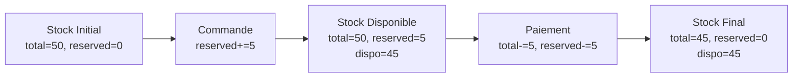

# Inventory API Reference

## Vue d'ensemble

Le **Inventory Service** expose une API REST pour la consultation du stock des produits.

### Base URL

```
http://localhost/api/inventory
```

Le service FastAPI est déclaré avec `root_path="/api/inventory"`. Le prefixe HTTP est fourni par Traefik dans Compose et par l'Ingress dans le parcours Kubernetes ; valider le couple chemin proxy/`root_path` après déploiement Helm.

### Authentification

Tous les endpoints (sauf `/health`) nécessitent un token JWT valide.

```
Authorization: Bearer <JWT_TOKEN>
```

## Endpoints

### GET /stock/{product_id}

Récupère le stock disponible pour un produit.

#### Request

**Path Parameters** :

| Parameter | Type | Description |
|-----------|------|-------------|
| `product_id` | string | Identifiant du produit |

**Headers** :
```
Authorization: Bearer <JWT_TOKEN>
```

#### Response

**200 OK - Produit trouvé** :
```json
{
  "product_id": "LAPTOP-001",
  "quantity": 45,
  "in_stock": true
}
```

**200 OK - Produit introuvable** :
```json
{
  "product_id": "UNKNOWN-001",
  "error": "Produit introuvable",
  "in_stock": false
}
```

**401 Unauthorized** :
```json
{
  "detail": "Token invalide ou expiré"
}
```

#### Calcul du stock

```
stock_disponible = total - reserved
```

- `total` : Stock total initial
- `reserved` : Stock réservé (commandes en attente)

#### Exemple

```bash
curl http://localhost/api/inventory/stock/LAPTOP-001 \
  -H "Authorization: Bearer <TOKEN>"
```

### GET /health

Health check du service.

#### Request

Aucun header requis.

#### Response

**200 OK** :
```json
{
  "status": "OK",
  "service": "inventory"
}
```

#### Exemple

```bash
curl http://localhost/api/inventory/health
```

## Événements Kafka Consommés

### Topic: `orders.created`

Réception d'une nouvelle commande pour réservation de stock.

**Schema** :
```json
{
  "order_id": "uuid",
  "product_id": "string",
  "quantity": "integer",
  "customer_id": "string",
  "status": "pending"
}
```

**Action** :
- Vérifier la disponibilité du stock
- Réserver la quantité (`reserved += quantity`)

### Topic: `payments.processed`

Confirmation d'un paiement pour déduction définitive.

**Schema** :
```json
{
  "order_id": "uuid",
  "customer_id": "string",
  "product_id": "string",
  "quantity": "integer",
  "amount": "float",
  "status": "success"
}
```

**Action** :
- Déduire la quantité du stock total (`total -= quantity`, `reserved -= quantity`)

## Produits Disponibles

| Product ID | Nom | Stock Initial |
|------------|-----|---------------|
| LAPTOP-001 | Ordinateur Portable Pro | 50 |
| PHONE-002 | Smartphone Z-Fold | 2 |
| MUG-003 | Mug Développeur | 100 |

## Codes d'Erreur

| Code | Description |
|------|-------------|
| 200 | Requête réussie |
| 401 | Token manquant ou invalide |
| 500 | Erreur interne du service |

## Exemples d'Utilisation

### Vérifier le stock

```bash
# Obtenir un token
TOKEN=$(curl -X POST http://localhost/auth/realms/ecommerce/protocol/openid-connect/token \
  -d "grant_type=password" \
  -d "client_id=ecomm-front" \
  -d "username=${KEYCLOAK_USER:?Définir KEYCLOAK_USER}" \
  -d "password=${KEYCLOAK_PASSWORD:?Définir KEYCLOAK_PASSWORD}" \
  | jq -r '.access_token')

# Vérifier le stock
curl http://localhost/api/inventory/stock/LAPTOP-001 \
  -H "Authorization: Bearer $TOKEN"
```

### Vérifier le health

```bash
curl http://localhost/api/inventory/health
```

## Flux de Stock



## Limitations

1. **Stock in-memory** : Perte des données au redémarrage
2. **Pas de concurrence** : Pas de locking pour les mises à jour
3. **Catalogue statique** : Produits pré-définis, pas de CRUD
4. **Pas de validation** : Ne vérifie pas la validité des événements Kafka

## Voir aussi

- [Architecture événementielle](../architecture/event-driven.md)
- [Orders API](./orders-api.md)
- [Payments API](./payments-api.md)
