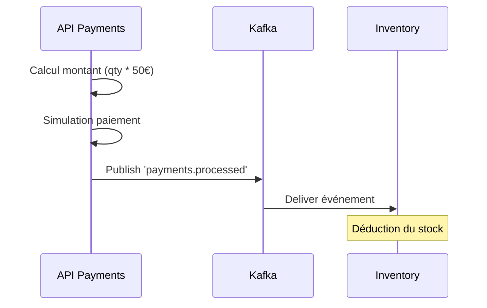

# Payments API Reference

## Vue d'ensemble

Le **Payments Service** expose une API REST pour le traitement des paiements.

### Base URL

```
http://localhost/api/payments
```

Le service FastAPI est déclaré avec `root_path="/api/payments"`. En Compose, Traefik retire le préfixe avant le forwarding ; en Kubernetes, le comportement du chemin doit être vérifié avec l'Ingress actuel.

### Authentification

Tous les endpoints (sauf `/health`) nécessitent un token JWT valide.

```
Authorization: Bearer <JWT_TOKEN>
```

## Endpoints

### POST /pay

Déclenche un paiement pour une commande.

#### Request

**Headers** :
```
Authorization: Bearer <JWT_TOKEN>
Content-Type: application/json
```

**Body** :
```json
{
  "order_id": "550e8400-e29b-41d4-a716-446655440000",
  "amount": 50.0
}
```

**Schema** :

| Field | Type | Required | Description |
|-------|------|----------|-------------|
| `order_id` | string | Yes | Identifiant de la commande |
| `amount` | float | Yes | Montant du paiement en euros |

#### Response

**201 Created** :
```json
{
  "transaction_id": "770f9511-f39c-4e2d-b816-223344550000",
  "order_id": "550e8400-e29b-41d4-a716-446655440000",
  "status": "success",
  "message": "Payment processed successfully"
}
```

**422 Unprocessable Entity** :
```json
{
  "detail": [
    {
      "type": "missing",
      "loc": ["body", "order_id"],
      "msg": "Field required"
    }
  ]
}
```

**401 Unauthorized** :
```json
{
  "detail": "Token invalide ou expiré"
}
```

#### Exemple

```bash
curl -X POST http://localhost/api/payments/pay \
  -H "Authorization: Bearer <TOKEN>" \
  -H "Content-Type: application/json" \
  -d '{
    "order_id": "550e8400-e29b-41d4-a716-446655440000",
    "amount": 50.0
  }'
```

### GET /health

Health check du service.

#### Request

Aucun header requis.

#### Response

**200 OK** :
```json
{
  "status": "OK",
  "service": "payments"
}
```

#### Exemple

```bash
curl http://localhost/api/payments/health
```

## Événements Kafka

### Topic: `orders.created` (Consommé)

Réception d'une nouvelle commande pour traitement du paiement.

**Schema** :
```json
{
  "order_id": "uuid",
  "product_id": "string",
  "quantity": "integer",
  "customer_id": "string",
  "status": "pending"
}
```

**Action** :
- Calculer le montant (`quantity * 50.0€`)
- Simuler le traitement du paiement
- Publier l'événement `payments.processed`

### Topic: `payments.processed` (Produit)

Publication du résultat du paiement.

**Schema** :
```json
{
  "order_id": "uuid",
  "customer_id": "string",
  "product_id": "string",
  "quantity": "integer",
  "amount": "float",
  "status": "success"
}
```

## Calcul du Montant

Pour le consommateur Kafka de `orders.created`, le montant est calculé automatiquement par le service :

```python
montant = commande['quantity'] * 50.0
```

**Note** : Prix fixe à 50€ par unité (simulation). Le endpoint HTTP `/pay` exige un champ `amount` pour valider le modèle, mais renvoie une réponse simulée et ne publie pas lui-même `payments.processed`.

## Codes d'Erreur

| Code | Description |
|------|-------------|
| 201 | Paiement traité avec succès |
| 422 | Données de requête invalides selon la validation FastAPI |
| 401 | Token manquant ou invalide |
| 500 | Erreur interne du service |

## Exemples d'Utilisation

### Traiter un paiement

```bash
# Obtenir un token
TOKEN=$(curl -X POST http://localhost/auth/realms/ecommerce/protocol/openid-connect/token \
  -d "grant_type=password" \
  -d "client_id=ecomm-front" \
  -d "username=${KEYCLOAK_USER:?Définir KEYCLOAK_USER}" \
  -d "password=${KEYCLOAK_PASSWORD:?Définir KEYCLOAK_PASSWORD}" \
  | jq -r '.access_token')

# Traiter un paiement
curl -X POST http://localhost/api/payments/pay \
  -H "Authorization: Bearer $TOKEN" \
  -H "Content-Type: application/json" \
  -d '{"order_id": "550e8400-e29b-41d4-a716-446655440000", "amount": 50.0}'
```

### Vérifier le health

```bash
curl http://localhost/api/payments/health
```

## Flux de Paiement



## Limitations

1. **Paiement simulé** : Toujours succès, pas de vérification réelle
2. **Prix fixe** : 50€ par unité, indépendant du produit
3. **Découplage API/Événement** : L'endpoint API et l'événement Kafka sont indépendants
4. **Pas d'historique** : Pas de stockage des transactions
5. **Pas de gestion d'erreur** : Pas de retry ou DLQ

## Voir aussi

- [Architecture événementielle](../architecture/event-driven.md)
- [Orders API](./orders-api.md)
- [Inventory API](./inventory-api.md)
