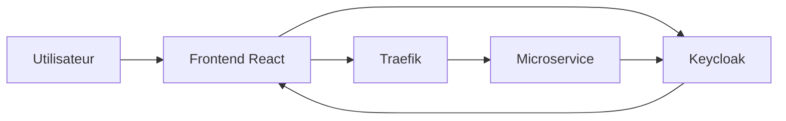
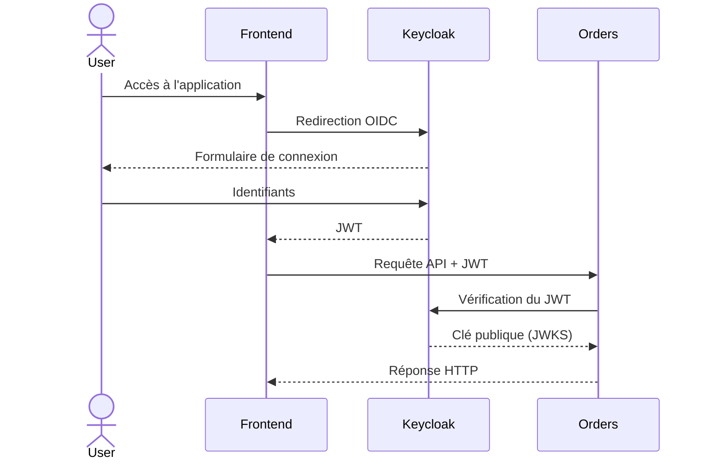
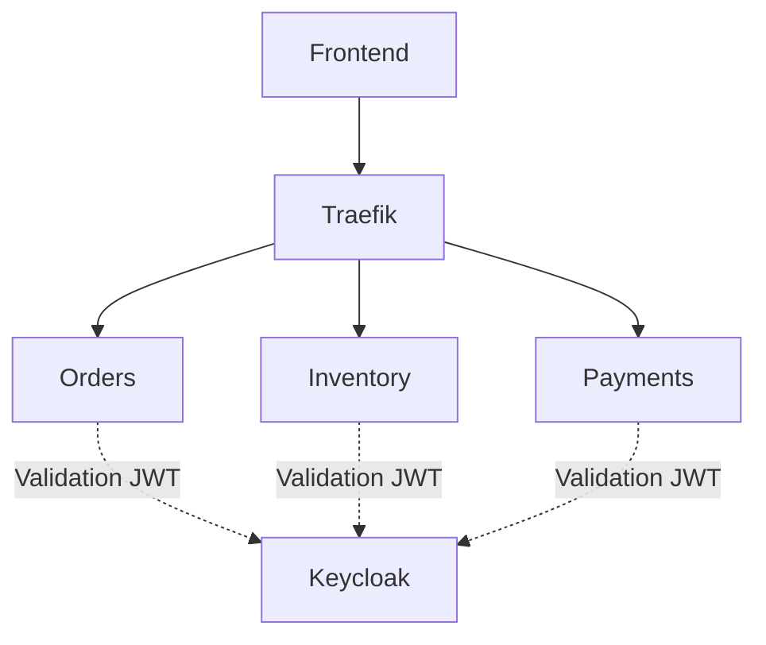
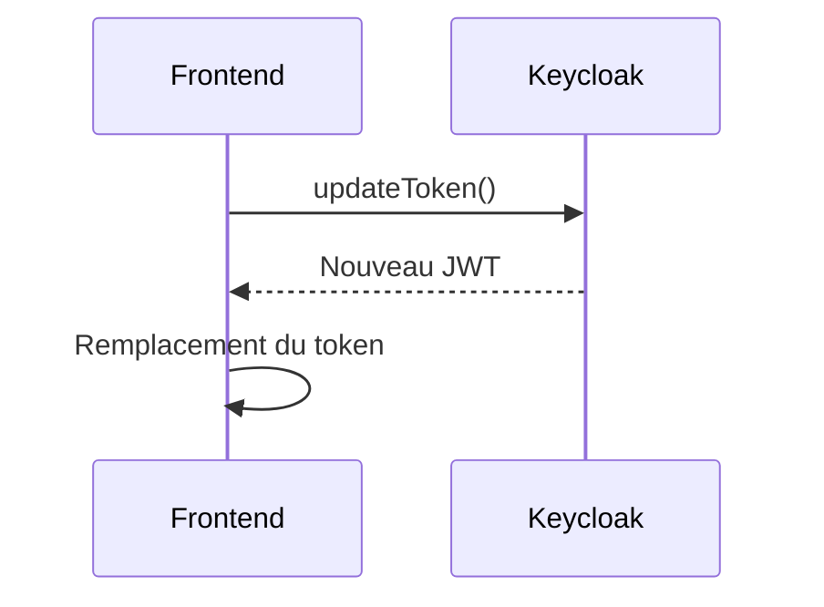

# Authentification

## Introduction

L'authentification de la plateforme est assurée par **Keycloak**, qui implémente les standards **OAuth 2.0** et **OpenID Connect (OIDC)**.

Les utilisateurs s'authentifient une seule fois auprès de Keycloak. Une fois connectés, ils reçoivent un **JSON Web Token (JWT)** qui est utilisé pour sécuriser l'ensemble des appels vers les microservices.

Cette approche présente plusieurs avantages :

- authentification centralisée ;
- gestion des utilisateurs indépendante des microservices ;
- utilisation d'un standard reconnu ;
- suppression des sessions côté serveur.

---

# Architecture de l'authentification



L'utilisateur ne communique jamais directement avec les microservices pour s'authentifier.

Toutes les opérations d'identité sont déléguées à Keycloak.

---

# Cycle de vie d'une authentification

Le diagramme suivant illustre le parcours complet d'une connexion utilisateur.



---

# Fonctionnement

Le mécanisme peut être résumé en quatre étapes.

## 1. Connexion

Lorsqu'un utilisateur souhaite accéder à la plateforme, le frontend déclenche une authentification auprès de Keycloak.

Après validation des identifiants, Keycloak génère un JWT signé.

---

## 2. Stockage du jeton

Le frontend conserve le token afin de l'utiliser lors des appels API.

Chaque requête HTTP contient alors automatiquement :

```http
Authorization: Bearer <JWT_TOKEN>
```

---

## 3. Validation

À chaque appel API, le microservice concerné vérifie :

- la signature du JWT ;
- son expiration ;
- son émetteur (`issuer`) ;
- son intégrité.

Pour cela, il récupère la clé publique publiée par Keycloak via l'endpoint **JWKS**.

Le service ne contacte jamais une base de données utilisateur.

---

## 4. Réponse

Si le JWT est valide :

- la requête est exécutée.

Sinon :

- le service retourne une erreur **401 Unauthorized**.

Le frontend peut alors rediriger automatiquement l'utilisateur vers la page de connexion.

---

# Intégration dans la plateforme



Tous les microservices utilisent exactement le même mécanisme de validation.

Cette approche garantit un comportement homogène sur l'ensemble de la plateforme.

---

# Configuration Keycloak

La plateforme utilise un **Realm** dédié nommé :

```
ecommerce
```

Le frontend est enregistré comme client OpenID Connect.

| Élément | Valeur |
|----------|--------|
| Realm | ecommerce |
| Client | ecomm-front |
| Protocole | OpenID Connect |
| Authentification | JWT |

---

# Points de terminaison utilisés

| Endpoint | Utilisation |
|------------|------------|
| `/auth` | Authentification utilisateur |
| `/protocol/openid-connect/token` | Obtention du JWT |
| `/protocol/openid-connect/certs` | Clés publiques (JWKS) |
| `/protocol/openid-connect/userinfo` | Informations utilisateur |
| `/protocol/openid-connect/logout` | Déconnexion |

Ces endpoints sont exposés par Traefik via le préfixe `/auth`.

---

# Structure d'un JWT

Un JWT est composé de trois parties.

```text
Header

Payload

Signature
```

Le payload contient notamment :

- l'identifiant utilisateur ;
- la date d'expiration ;
- le client concerné ;
- le nom d'utilisateur.

Exemple simplifié :

```json
{
    "preferred_username": "user",
    "iss": "...",
    "exp": 1721721600,
    "azp": "ecomm-front"
}
```

---

# Renouvellement du token

Afin d'éviter une nouvelle authentification à chaque expiration, le frontend renouvelle automatiquement le JWT.



Cette opération est transparente pour l'utilisateur.

---

# Bonnes pratiques mises en œuvre

La plateforme applique plusieurs bonnes pratiques de sécurité.

- Validation de la signature du JWT.
- Vérification de l'émetteur.
- Utilisation des clés publiques JWKS.
- Authentification centralisée.
- Aucun mot de passe stocké dans les microservices.

---

# Améliorations possibles

Dans un contexte de production, plusieurs évolutions pourraient être apportées.

- Utilisation systématique de HTTPS.
- Vérification stricte de l'audience (`aud`).
- Mise en place d'un contrôle d'accès par rôles (RBAC).
- Base de données persistante pour Keycloak.
- Rotation automatique des secrets.
- Configuration CORS plus restrictive.

---

# Gestion des erreurs

| Code | Cause |
|------|-------|
| 401 | JWT invalide ou expiré |
| 403 | Accès interdit |
| 500 | Keycloak indisponible |

---

# À retenir

La plateforme délègue entièrement la gestion de l'identité à Keycloak.

Les microservices ne manipulent jamais les mots de passe des utilisateurs.

Ils se contentent de vérifier les JWT reçus dans chaque requête.

Cette architecture permet de centraliser la sécurité tout en conservant des services indépendants et faiblement couplés.