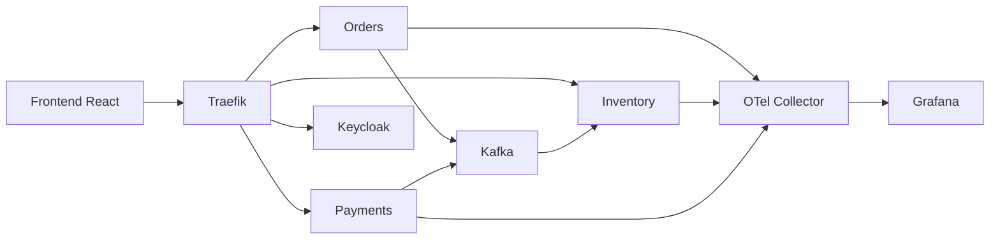
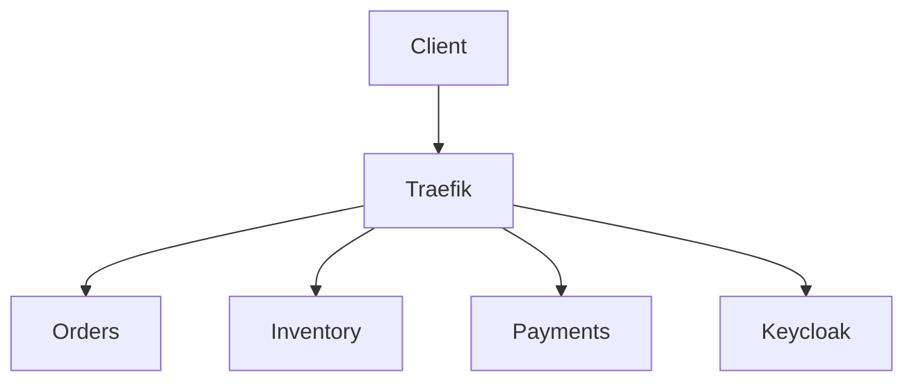
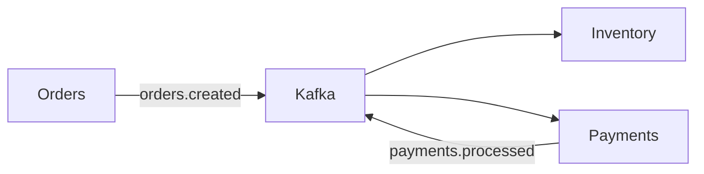
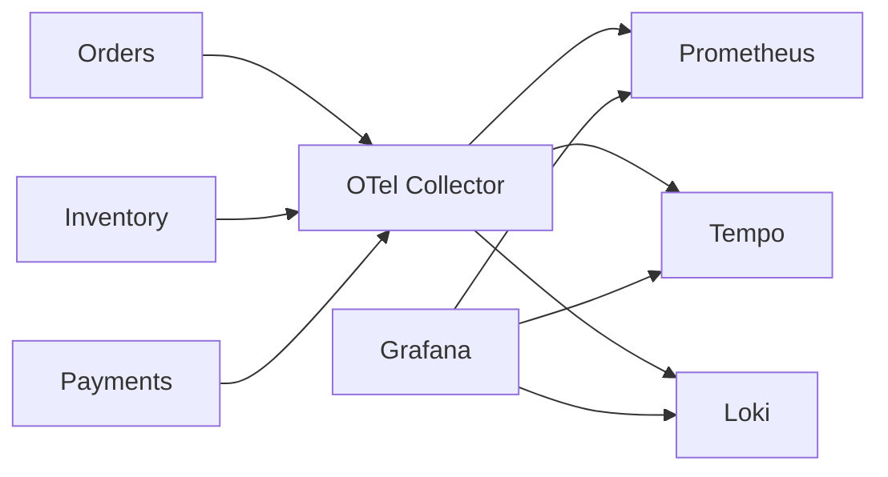

# Composants de la plateforme

## Introduction

La plateforme est composée de plusieurs services spécialisés qui collaborent afin d'assurer le fonctionnement complet de l'application e-commerce.

Chaque composant possède une responsabilité précise, ce qui permet de limiter les dépendances entre services et de faciliter leur évolution.

---

# Vue des composants



---

# Organisation de la plateforme

Les composants peuvent être regroupés selon leur responsabilité.

| Domaine | Composants | Rôle |
|----------|------------|------|
| Interface utilisateur | React | Interaction avec l'utilisateur |
| Routage | Traefik | Point d'entrée HTTP |
| Métier | Orders, Inventory, Payments | Traitement des fonctionnalités métier |
| Authentification | Keycloak | Gestion des utilisateurs et des JWT |
| Communication | Kafka | Transport des événements |
| Observabilité | OpenTelemetry, Prometheus, Tempo, Loki, Grafana | Supervision de la plateforme |

---

# Frontend React

Le frontend constitue l'interface utilisateur de la plateforme.

Développé avec **React** et **Vite**, il permet :

- la navigation dans l'application ;
- l'authentification auprès de Keycloak ;
- l'envoi des requêtes HTTP vers Traefik ;
- l'affichage des informations retournées par les microservices.

Le frontend ne communique jamais directement avec les services métier.

```text
Utilisateur
      │
Frontend
      │
Traefik
```

---

# Traefik

Traefik joue le rôle d'API Gateway.

Toutes les requêtes HTTP transitent par lui avant d'être redirigées vers le microservice correspondant.

Ses responsabilités sont les suivantes :

- centraliser les points d'entrée ;
- simplifier le routage ;
- masquer l'architecture interne ;
- exposer Keycloak sous le chemin `/auth`.



---

# Les microservices

Chaque microservice implémente une partie du domaine fonctionnel.

## Orders Service

Responsable de :

- créer une commande ;
- générer un identifiant unique ;
- publier l'événement `orders.created`.

Le service ne gère pas directement le paiement ni le stock.

---

## Inventory Service

Responsable de :

- consulter le stock ;
- réserver temporairement les produits ;
- déduire définitivement les quantités après validation du paiement.

Il consomme les événements publiés dans Kafka.

---

## Payments Service

Responsable de :

- traiter les paiements ;
- publier l'événement `payments.processed`.

Il est totalement indépendant du service Orders.

---

# Apache Kafka

Kafka permet aux microservices d'échanger des événements sans communication directe.

Cette architecture réduit le couplage entre services.



Les deux topics utilisés sont :

| Topic | Producteur | Consommateurs |
|---------|------------|---------------|
| `orders.created` | Orders | Inventory, Payments |
| `payments.processed` | Payments | Inventory |

---

# Keycloak

Keycloak centralise toute la gestion de l'identité.

Il prend en charge :

- l'authentification ;
- la génération des JWT ;
- la validation des utilisateurs ;
- la gestion des sessions.

Les microservices n'ont donc jamais accès aux mots de passe des utilisateurs.

```text
Utilisateur

↓

Keycloak

↓

JWT

↓

Frontend

↓

Microservices
```

---

# Stack d'observabilité

Tous les microservices sont instrumentés avec OpenTelemetry.

Le collecteur reçoit les données puis les redistribue vers les différents outils spécialisés.



Chaque composant possède un rôle spécifique.

| Outil | Fonction |
|--------|----------|
| OpenTelemetry Collector | Centralise les données de télémétrie |
| Prometheus | Stockage des métriques |
| Tempo | Stockage des traces distribuées |
| Loki | Stockage des logs |
| Grafana | Visualisation des données |

---

# Accès aux services

Cette table décrit les ports publiés par Docker Compose. En Kubernetes, les composants d'infrastructure sont principalement des services `ClusterIP` dans `ecommerce`, le dashboard Traefik est désactivé et Kafka UI n'est pas déployé par les charts actuels. Utiliser un `kubectl port-forward` pour une consultation ponctuelle.

| Service | URL |
|----------|-----|
| Frontend | http://localhost |
| Keycloak | http://localhost/auth |
| Dashboard Traefik | http://localhost:8090 |
| Kafka UI | http://localhost:8081 |
| Grafana | http://localhost:3000 |
| Prometheus | http://localhost:9090 |
| Loki | http://localhost:3100 |
| Tempo | http://localhost:3200 |

---

# Ports exposés

| Port | Service |
|------|---------|
| 80 | Traefik |
| 8090 | Dashboard Traefik |
| 8081 | Kafka UI |
| 3000 | Grafana |
| 3100 | Loki |
| 3200 | Tempo |
| 9090 | Prometheus |
| 9092 | Kafka |

---

# À retenir

La plateforme est organisée autour de composants spécialisés qui coopèrent selon trois modes de communication :

- **HTTP**, utilisé entre le frontend et les microservices via Traefik ;
- **Kafka**, utilisé pour les échanges asynchrones entre services ;
- **OpenTelemetry**, utilisé pour centraliser les données d'observabilité.

Cette séparation des responsabilités facilite la maintenance, le déploiement et l'évolution de la plateforme.
