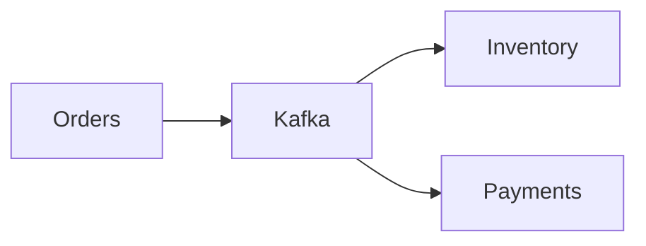
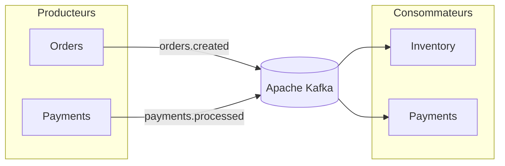
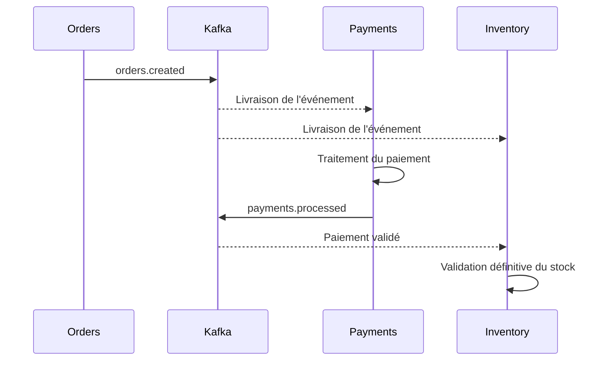
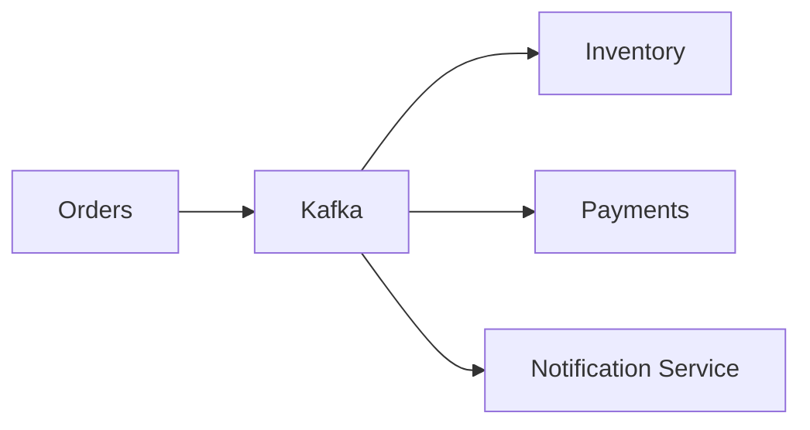

# Communication événementielle

## Introduction

Les microservices de la plateforme communiquent principalement de manière **asynchrone** grâce à **Apache Kafka**.

Dans l'implémentation actuelle, les échanges réellement codés sont `orders.created` et `payments.processed`. Orders ne persiste pas la commande, Payments simule le paiement avec un prix fixe et aucun mécanisme de retry ou de dead-letter queue n'est configuré. Les propriétés de résilience et de scalabilité décrites plus loin sont donc des objectifs d'architecture, pas des garanties de cette démonstration.

Contrairement aux appels HTTP, où un service attend immédiatement une réponse, la communication événementielle permet aux producteurs et aux consommateurs d'échanger des informations sans dépendre directement les uns des autres.

Cette approche améliore la résilience, facilite l'évolution de la plateforme et réduit le couplage entre les services.

---

# Pourquoi une architecture événementielle ?

Une communication purement synchrone présenterait plusieurs inconvénients.

Par exemple, après la création d'une commande, le service **Orders** devrait appeler directement :

- Inventory ;
- Payments ;
- puis attendre leurs réponses.

Le moindre ralentissement d'un service impacterait immédiatement toute la plateforme.

Avec Kafka, Orders publie simplement un événement.

Les autres services réagissent lorsqu'ils sont prêts.



Cette architecture découple complètement les producteurs et les consommateurs.

---

# Vue globale des échanges

Le diagramme suivant présente les principaux flux événementiels de la plateforme.



Les services ne communiquent jamais directement entre eux.

Toute interaction métier passe par Kafka.

---

# Les événements métier

Deux événements principaux sont échangés dans la plateforme.

| Événement | Producteur | Consommateurs | Description |
|------------|------------|---------------|-------------|
| `orders.created` | Orders | Inventory, Payments | Une nouvelle commande vient d'être créée. |
| `payments.processed` | Payments | Inventory | Le paiement a été validé. |

Ces événements représentent les informations métier circulant dans le système.

---

# Cycle de vie d'une commande

Le scénario suivant illustre le parcours complet d'une commande.



Chaque service exécute son traitement de manière totalement indépendante.

---

# Déroulement détaillé

## 1. Création de la commande

Le service **Orders** reçoit une requête HTTP.

Après validation, il génère un identifiant de commande puis publie :

```
orders.created
```

À ce stade, la requête HTTP est terminée.

Le client reçoit immédiatement une confirmation.

---

## 2. Traitement parallèle

Kafka distribue automatiquement l'événement.

Deux consommateurs réagissent simultanément.

### Payments

Le service Payments traite le paiement.

### Inventory

Le service Inventory réserve temporairement le stock.

Aucun de ces traitements ne bloque l'autre.

---

## 3. Validation du paiement

Lorsque le paiement est accepté, Payments publie un second événement.

```
payments.processed
```

Cet événement informe les autres services que le paiement est terminé.

---

## 4. Mise à jour du stock

Inventory reçoit l'événement.

La réservation temporaire devient alors une déduction définitive.

Le cycle métier est terminé.

---

# Chronologie simplifiée

```text
HTTP

Client

↓

Orders

↓

orders.created

↓

Kafka

──────────────

Asynchrone

↓

Payments

↓

payments.processed

↓

Kafka

↓

Inventory

↓

Stock mis à jour
```

---

# Les topics Kafka

La plateforme utilise deux topics.

| Topic | Producteur | Description |
|---------|------------|-------------|
| `orders.created` | Orders | Création d'une commande |
| `payments.processed` | Payments | Paiement terminé |

Les consommateurs s'abonnent uniquement aux topics qui les intéressent.

Cette approche facilite l'ajout de nouveaux services.

---

# Exemple d'évolution

Supposons que l'on souhaite ajouter un service :

```
Notification Service
```

Aucune modification n'est nécessaire dans Orders.

Il suffit de consommer :

```
orders.created
```

Le nouveau service peut alors envoyer :

- un e-mail ;
- une notification mobile ;
- un SMS.



Le producteur ignore complètement que ce nouveau consommateur existe.

---

# Avantages de cette architecture

## Découplage

Les producteurs ne connaissent pas leurs consommateurs.

Ils publient uniquement des événements.

---

## Scalabilité

Chaque service peut évoluer indépendamment.

Par exemple, plusieurs instances de Payments peuvent traiter les paiements en parallèle sans modifier Orders.

---

## Résilience

Si un consommateur est temporairement indisponible, Kafka conserve les messages.

Le traitement pourra reprendre dès que le service redeviendra disponible.

---

## Extensibilité

L'ajout d'un nouveau service ne nécessite pas de modifier les producteurs.

Il suffit de consommer les événements existants.

---

## Audit

Les événements représentent un historique des opérations métier.

Ils facilitent le suivi et le diagnostic des traitements.

---

# Limites

Une architecture événementielle présente également quelques contraintes.

- les traitements deviennent plus difficiles à suivre ;
- la cohérence est dite **éventuelle** ;
- le débogage nécessite des outils adaptés ;
- la gestion des erreurs est plus complexe qu'en HTTP.

Ces contraintes sont largement compensées par les bénéfices obtenus sur une architecture distribuée.

---

# Surveillance des événements

Les échanges Kafka peuvent être observés grâce à plusieurs outils de la plateforme.

| Outil | Utilisation |
|---------|-------------|
| Kafka UI | Visualisation des topics et des messages |
| Grafana | Supervision globale |
| Loki | Consultation des logs |
| Tempo | Analyse des traces distribuées |

Ces outils facilitent le diagnostic des traitements asynchrones.

---

# À retenir

La communication événementielle constitue le cœur de la plateforme.

Les appels HTTP servent uniquement à initier les traitements.

Une fois la commande créée, les échanges entre microservices reposent exclusivement sur Kafka.

Cette architecture permet de construire une plateforme :

- faiblement couplée ;
- facilement extensible ;
- résiliente ;
- adaptée aux architectures microservices modernes.
