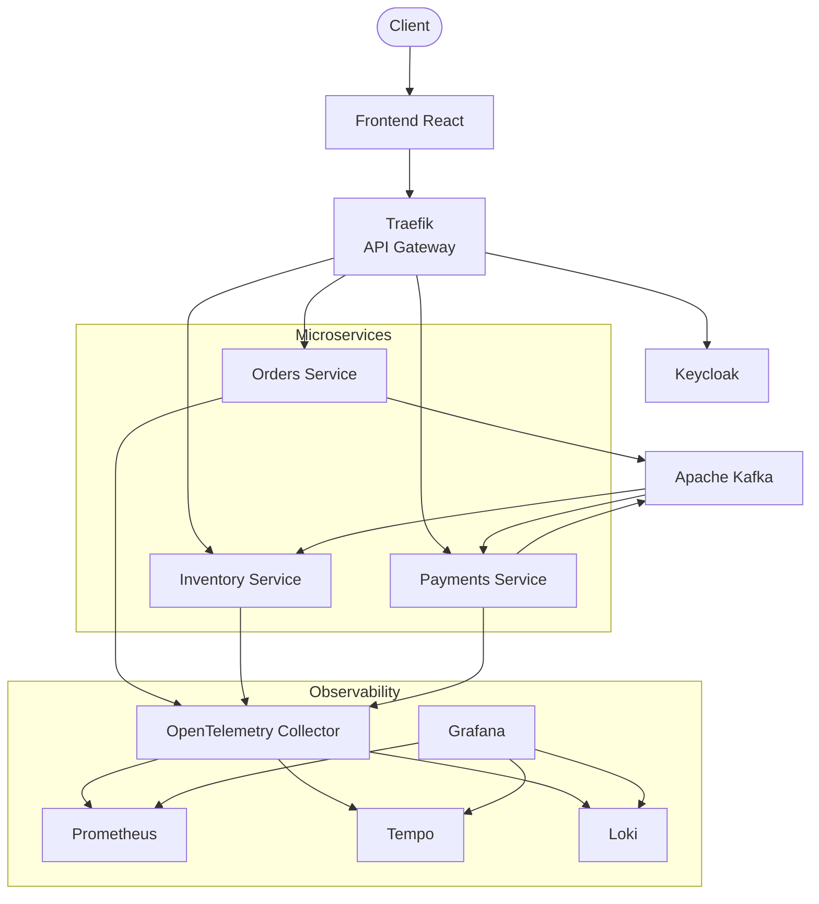
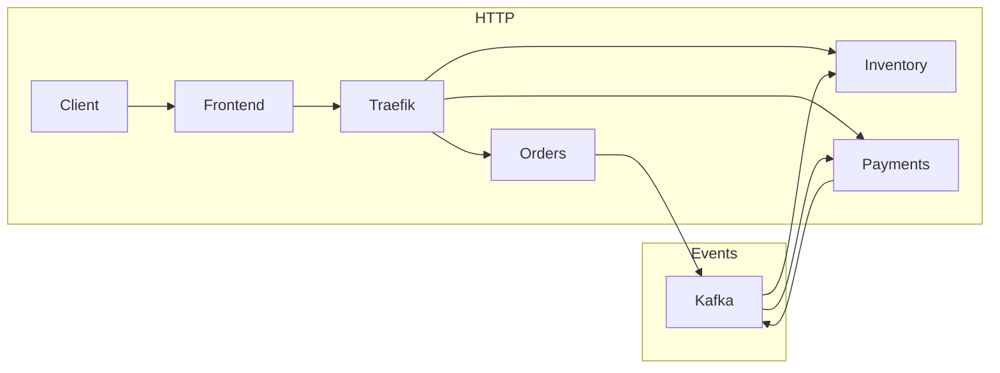

# Vue d'ensemble de l'Architecture

## Principes Architecturaux

La plateforme repose sur une architecture **microservices** où chaque composant possède une responsabilité clairement définie. Cette approche permet de développer, déployer et faire évoluer les différents services de manière indépendante tout en conservant une architecture cohérente et facilement extensible.

L'ensemble des communications HTTP est centralisé par **Traefik**, tandis que les échanges asynchrones entre services sont réalisés grâce à **Apache Kafka**. L'authentification est assurée par **Keycloak** et l'observabilité de la plateforme est prise en charge par **OpenTelemetry** et la stack Grafana.

---
## Architecture globale



---
## Les principaux composants

L'architecture est organisée autour de cinq grandes briques fonctionnelles.

| Composant | Rôle |
|------------|------|
| **Frontend React** | Interface utilisateur permettant la navigation et les interactions avec la plateforme. |
| **Traefik** | Point d'entrée unique des requêtes HTTP. Il distribue les appels vers les microservices appropriés. |
| **Microservices FastAPI** | Implémentent la logique métier (commandes, stock, paiements). |
| **Apache Kafka** | Transporte les événements métier entre les services de manière asynchrone. |
| **Stack d'observabilité** | Centralise les métriques, logs et traces afin de superviser la plateforme. |

---

## Fonctionnement général

Le fonctionnement de la plateforme peut être résumé en quatre étapes.

### 1. Authentification

L'utilisateur accède au frontend puis s'authentifie auprès de **Keycloak**.

Après une authentification réussie, un **JWT** est renvoyé au frontend qui l'utilisera pour toutes les requêtes API.

---

### 2. Communication HTTP

Toutes les requêtes transitent par **Traefik**, qui joue le rôle d'API Gateway.

Selon le chemin demandé (`/orders`, `/inventory`, `/payments`...), Traefik redirige automatiquement la requête vers le microservice concerné.

```text
Client
    │
Frontend
    │
Traefik
    │
Microservice
```

---

### 3. Communication événementielle

Les opérations métier importantes génèrent des événements publiés dans **Apache Kafka**.

Par exemple :

- une commande crée un événement `orders.created`
- un paiement réussi produit `payments.processed`

Les autres services peuvent ensuite consommer ces événements sans dépendance directe avec le producteur.

Cette approche réduit le couplage entre les microservices et facilite leur évolution.

---

### 4. Observabilité

Chaque microservice envoie automatiquement ses données de télémétrie vers **OpenTelemetry Collector**.

Le collecteur redistribue ensuite les informations vers les différents outils spécialisés :

- **Prometheus** pour les métriques
- **Tempo** pour les traces distribuées
- **Loki** pour les logs

Enfin, **Grafana** centralise toutes ces informations au sein de tableaux de bord uniques.

---

## Vue simplifiée des flux

Le diagramme suivant résume les deux principaux types de communication de la plateforme.



---

## Principes d'architecture

La conception de cette plateforme repose sur plusieurs principes.

### Séparation des responsabilités

Chaque microservice est responsable d'un domaine métier unique.

- Orders gère les commandes
- Inventory gère le stock
- Payments gère les paiements

Cette séparation simplifie la maintenance et favorise l'évolution indépendante des services.

---

### Faible couplage

Les microservices ne communiquent pas directement entre eux.

Les échanges métier utilisent Kafka afin de limiter les dépendances et de rendre la plateforme plus résiliente.

---

### Observabilité native

L'observabilité est intégrée dès la conception.

Tous les services sont instrumentés afin de produire automatiquement :

- des métriques,
- des traces distribuées,
- des logs structurés.

Ces données sont centralisées dans Grafana pour faciliter le diagnostic et le suivi de la plateforme.

---

### Authentification centralisée

La gestion des utilisateurs est entièrement déléguée à Keycloak.

Les microservices n'ont donc pas besoin de gérer eux-mêmes :

- les comptes utilisateurs ;
- les mots de passe ;
- les sessions.

Ils vérifient simplement les jetons JWT reçus dans les requêtes.

---

## À retenir

Cette architecture combine plusieurs approches complémentaires :

- une **communication synchrone** via HTTP entre le frontend et les microservices ;
- une **communication asynchrone** via Kafka pour les événements métier ;
- une **authentification centralisée** grâce à Keycloak ;
- une **observabilité unifiée** basée sur OpenTelemetry et Grafana.

Cette organisation permet de construire une plateforme modulaire, évolutive et facilement supervisable.