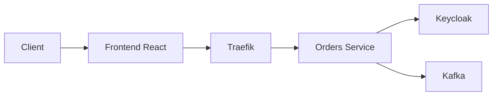
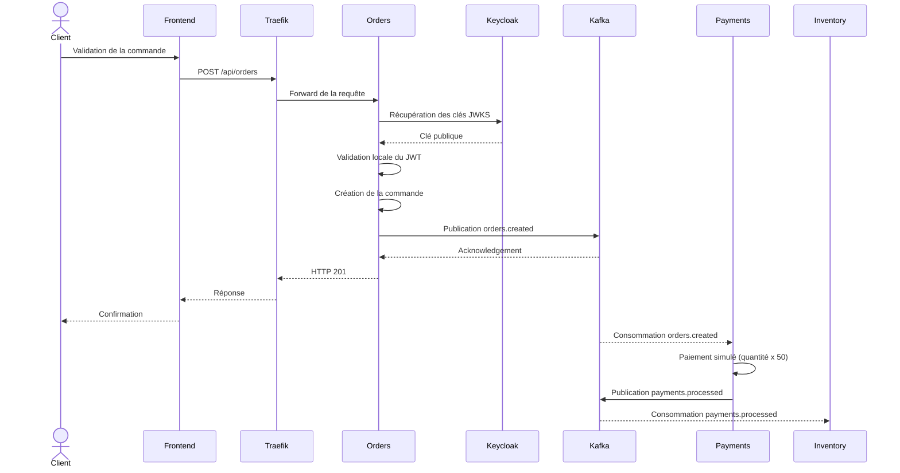
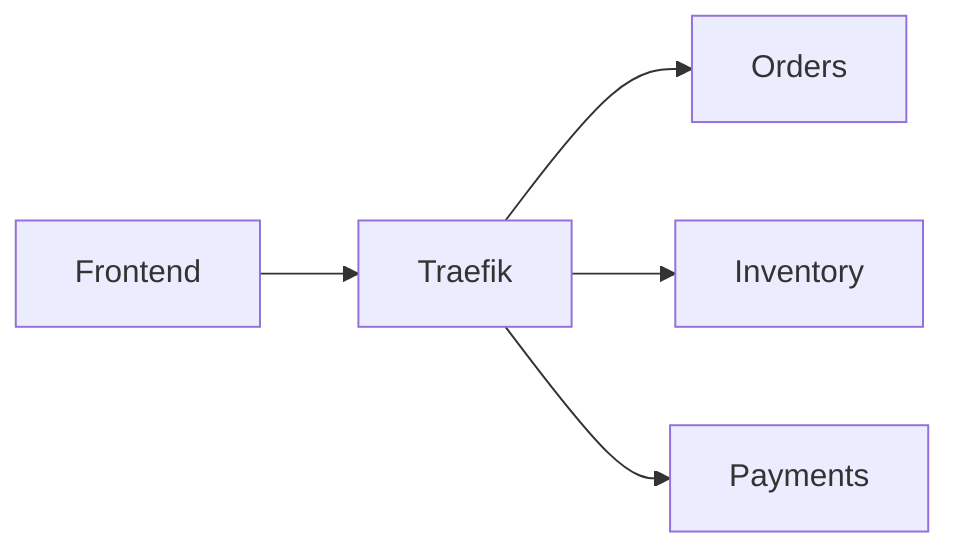
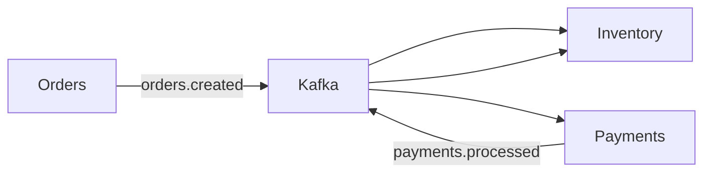

# Flux d'une requête HTTP

## Introduction

Cette page décrit le parcours complet d'une requête HTTP au sein de la plateforme, depuis l'action de l'utilisateur jusqu'à la création d'une commande.

L'objectif est de comprendre comment les différents composants collaborent lors d'un appel API, avant que les traitements asynchrones ne prennent le relais via Apache Kafka.

---

# Vue d'ensemble

Le diagramme suivant présente les principaux acteurs impliqués dans le traitement d'une requête. Les services vérifient localement le JWT en récupérant les clés publiques de Keycloak ; ils ne délèguent pas chaque requête à un endpoint d'autorisation distant.



---

# Les différentes étapes

Le traitement d'une commande peut être décomposé en cinq étapes.

1. Authentification
2. Envoi de la requête
3. Routage par Traefik
4. Traitement métier
5. Publication de l'événement

---

# Séquence complète



---

# Étape 1 — Authentification

Avant toute opération métier, l'utilisateur doit être authentifié.

Le frontend récupère un jeton JWT auprès de Keycloak lors de la connexion.

Toutes les requêtes suivantes incluent automatiquement ce jeton dans l'en-tête HTTP.

```http
Authorization: Bearer <JWT_TOKEN>
```

Les détails de ce mécanisme sont présentés dans la section **Authentification**.

---

# Étape 2 — Envoi de la requête

Lorsqu'un utilisateur valide son panier, le frontend envoie une requête HTTP vers l'API.

Exemple :

```http
POST /api/orders
```

avec un corps similaire à :

```json
{
  "product_id": "LAPTOP-001",
  "customer_id": "<USERNAME>",
  "quantity": 1
}
```

Le frontend ne contacte jamais directement les microservices.

Toutes les requêtes transitent par Traefik.

---

# Étape 3 — Routage par Traefik

Traefik constitue l'unique point d'entrée HTTP de la plateforme.

Selon le chemin demandé, il redirige automatiquement la requête vers le microservice concerné.



Par exemple :

| Requête | Destination |
|----------|-------------|
| `/api/orders` | Orders Service |
| `/api/inventory` | Inventory Service |
| `/api/payments` | Payments Service |
| `/auth` | Keycloak |

Cette architecture masque complètement l'organisation interne des services.

---

# Étape 4 — Traitement de la commande

Le service **Orders** reçoit la requête.

Il effectue plusieurs opérations :

- validation des données ;
- vérification du JWT ;
- génération d'un identifiant de commande ;
- création de la commande ;
- préparation de l'événement métier.

À ce stade, aucun autre microservice métier n'est appelé directement ; la seule dépendance synchrone est la récupération des clés publiques de Keycloak pour valider le JWT.

Le traitement reste entièrement local au service Orders.

---

# Étape 5 — Publication d'un événement

Une fois la commande créée, Orders publie un événement dans Apache Kafka. Les consommateurs sont indépendants de la réponse HTTP : Payments consomme `orders.created`, simule un paiement et publie `payments.processed`, puis Inventory consomme cet événement pour déduire le stock.



La requête HTTP est alors terminée.

Les traitements complémentaires (paiement simulé, réservation et déduction du stock) sont réalisés de manière asynchrone.

Le endpoint HTTP `POST /api/payments/pay` est un chemin séparé : dans l'implémentation actuelle, il renvoie directement une réponse de paiement simulé et ne publie pas lui-même `payments.processed`.

Cette séparation permet de conserver une faible latence côté utilisateur.

---

# Réponse retournée au client

Après la publication de l'événement, Orders renvoie immédiatement une réponse HTTP.

Exemple :

```json
{
  "order_id": "b9d44c2d",
  "status": "pending"
}
```

Le frontend peut alors informer l'utilisateur que sa commande a été enregistrée.

Les traitements suivants continueront en arrière-plan.

---

# Endpoints disponibles

| Méthode | Endpoint | Service |
|----------|----------|---------|
| POST | `/api/orders/` | Orders |
| GET | `/api/orders/health` | Orders |
| GET | `/api/inventory/stock/{id}` | Inventory |
| GET | `/api/inventory/health` | Inventory |
| POST | `/api/payments/pay` | Payments |
| GET | `/api/payments/health` | Payments |

---

# Exemple avec curl

```bash
curl -X POST http://localhost/api/orders/ \
  -H "Authorization: Bearer <TOKEN>" \
  -H "Content-Type: application/json" \
  -d '{
        "product_id":"LAPTOP-001",
        "customer_id":"<USERNAME>",
        "quantity":1
      }'
```

---

# Gestion des erreurs

Les principaux codes HTTP retournés sont :

| Code | Signification |
|------|---------------|
| 200 | Requête exécutée avec succès |
| 201 | Ressource créée |
| 422 | Données invalides selon la validation FastAPI |
| 401 | Authentification invalide |
| 404 | Ressource introuvable |
| 500 | Erreur interne |

---

# Pourquoi ce fonctionnement ?

Cette architecture apporte plusieurs avantages.

### Point d'entrée unique

Toutes les requêtes passent par Traefik, ce qui simplifie le routage et l'exposition des services.

### Services indépendants

Chaque microservice traite uniquement son domaine fonctionnel.

### Réponse rapide

Le client reçoit une confirmation dès que la commande est enregistrée et que la publication Kafka a été acquittée.

Les traitements complémentaires sont réalisés ensuite via Kafka ; ils peuvent donc continuer après la réponse HTTP.

### Évolutivité

Le nombre de microservices peut évoluer sans modifier le frontend.

---

# À retenir

Le traitement d'une requête HTTP suit toujours le même principe :

```text
Client

↓

Frontend React

↓

Traefik

↓

Microservice

↓

Validation JWT

↓

Traitement métier

↓

Publication Kafka

↓

Réponse HTTP
```

Une fois la réponse renvoyée, les traitements asynchrones prennent le relais grâce à Apache Kafka, permettant de conserver une architecture faiblement couplée et réactive.
