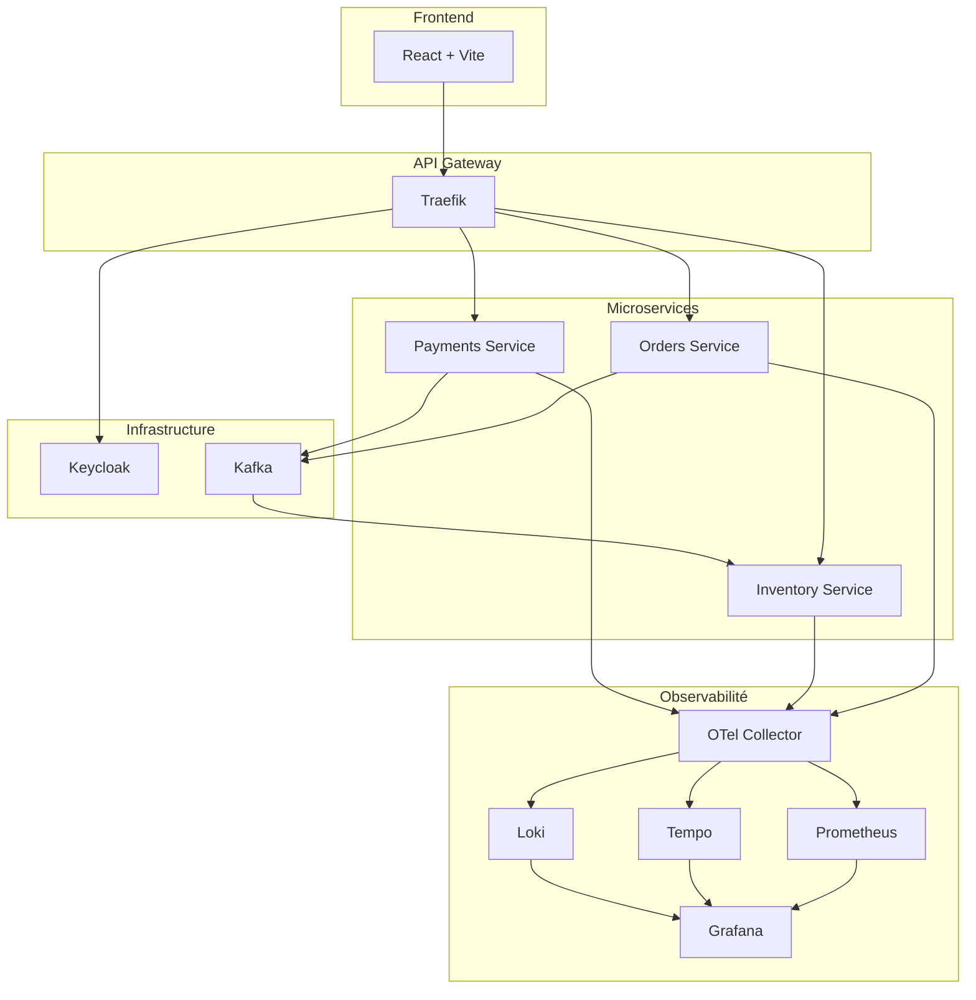

# ECommerce Platform - Documentation Technique

## Présentation

Cette plateforme e-commerce est une démonstration technique d'une architecture microservices moderne, conçue pour illustrer les concepts suivants :

- **Architecture microservices** découplée
- **Communication événementielle** avec Apache Kafka
- **Authentification centralisée** avec Keycloak (OAuth2/OIDC)
- **Routage API** avec Traefik
- **Observabilité distribuée** avec OpenTelemetry, Prometheus, Tempo, Loki et Grafana

## Objectifs Pédagogiques

Ce projet vise à montrer comment :

1. Découpler des services métier indépendants
2. Mettre en place une communication asynchrone via des événements
3. Sécuriser les APIs avec un fournisseur d'identité centralisé
4. Implémenter une stack d'observabilité complète (logs, metrics, traces)
5. Orchestrer des conteneurs avec Docker Compose et Kubernetes

## Technologies Utilisées

| Catégorie | Technologies |
|-----------|-------------|
| **Backend** | Python 3.11, FastAPI, Uvicorn |
| **Frontend** | React 19, Vite, Axios |
| **Message Broker** | Apache Kafka 4.0 |
| **Authentification** | Keycloak 24 |
| **API Gateway** | Traefik 3.6 |
| **Observabilité** | OpenTelemetry, Prometheus, Tempo, Loki, Grafana |
| **Orchestration** | Docker Compose, Kubernetes, Helm, Helmfile |

## Architecture Globale



## Structure du Projet

```
ECommerce-Platform/
├── frontend/              # Application React
├── services/
│   ├── orders/           # Service de commandes
│   ├── inventory/        # Service de gestion de stock
│   └── payments/         # Service de paiement
├── infra/
│   ├── docker-compose.yml
│   ├── helm/             # Charts Helm et Helmfile
│   └── otel/             # Configuration observabilité
└── documentation/        # Cette documentation
```

## Démarrage Rapide

```bash
# Cloner le repository
git clone <repository-url>
cd ECommerce-Platform

# Démarrer tous les services Compose depuis la racine
docker compose -f infra/docker-compose.yml up --build

# Accéder aux services
# - Frontend: http://localhost
# - Traefik Dashboard: http://localhost:8090
# - Kafka UI: http://localhost:8081
# - Grafana: http://localhost:3000
# - Keycloak: http://localhost/auth
```

Ce démarrage rapide concerne Docker Compose. Pour le parcours Kubernetes local, consulter le [guide Minikube](development/minikube.md), puis les pages [Kubernetes](infrastructure/kubernetes.md), [Helm](infrastructure/helm.md) et [Helmfile](infrastructure/helmfile.md). Le dashboard Traefik est activé par Compose mais désactivé dans les valeurs Helm dev.

## Navigation

- **[Architecture](architecture/overview.md)** - Vue d'ensemble et flux
- **[Microservices](services/orders.md)** - Documentation des services
- **[Infrastructure](infrastructure/docker.md)** - Configuration Docker Compose
- **[Kubernetes](infrastructure/kubernetes.md)** - Ressources et namespaces Kubernetes
- **[Helmfile](infrastructure/helmfile.md)** - Orchestration des releases
- **[Observabilité](observability/overview.md)** - Monitoring et tracing
- **[API Reference](api/orders-api.md)** - Documentation des APIs
- **[Développement](development/setup.md)** - Guide de mise en place

## Informations

- **Version**: 1.0
- **Dernière mise à jour**: Juillet 2026
- **Maintenu par**: Équipe de développement
