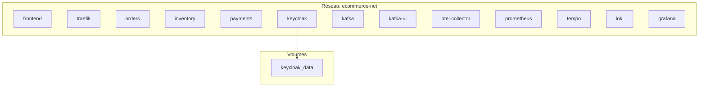

# Configuration Docker

## Vue d'ensemble

L'infrastructure est orchestrée via **Docker Compose**. Tous les services tournent dans des conteneurs isolés sur un réseau Docker commun.

## Services Docker Compose



## Configuration des Services

### Frontend

```yaml
frontend:
  build:
    context: ../frontend
  volumes:
    - ../frontend:/app
    - /app/node_modules
  labels:
    - "traefik.enable=true"
    - "traefik.http.routers.frontend.rule=PathPrefix(`/`)"
    - "traefik.http.services.frontend.loadbalancer.server.port=5173"
```

**Notes** :
- Le volume `/app/node_modules` empêche d'écraser les modules Linux par ceux de l'hôte
- Le code source est monté en temps réel pour le HMR (Hot Module Reload)

### Orders Service

```yaml
orders:
  build: ../services/orders
  volumes:
    - ../services/orders:/app
  command: uvicorn main:app --host 0.0.0.0 --port 8000 --reload
  depends_on:
    kafka:
      condition: service_healthy
  labels:
    - "traefik.enable=true"
    - "traefik.http.routers.orders.rule=PathPrefix(`/api/orders`)"
    - "traefik.http.middlewares.orders-strip.stripprefix.prefixes=/api/orders"
    - "traefik.http.routers.orders.middlewares=orders-strip"
    - "traefik.http.services.orders.loadbalancer.server.port=8000"
```

**Notes** :
- `--reload` active le hot reload pour le développement
- Le middleware `strip` retire le préfixe `/api/orders` avant de forwarder

### Inventory Service

Configuration identique à Orders, avec :
- Route: `/api/inventory`
- Middleware: `inventory-strip`

### Payments Service

Configuration identique à Orders, avec :
- Route: `/api/payments`
- Middleware: `payments-strip`

### Traefik

```yaml
traefik:
  image: traefik:v3.6
  container_name: traefik
  command:
    - "--api.insecure=true"
    - "--providers.docker=true"
    - "--providers.docker.exposedbydefault=false"
    - "--entrypoints.web.address=:80"
  ports:
    - "80:80"
    - "8090:8080"
  volumes:
    - /var/run/docker.sock:/var/run/docker.sock:ro
```

**Configuration** :
- `api.insecure=true` : Active le dashboard (désactiver en production)
- `providers.docker=true` : Découvre automatiquement les services
- `exposedbydefault=false` : Seul les services avec `traefik.enable=true` sont exposés
- `docker.sock` : Permet à Traefik de lire les labels des conteneurs

### Keycloak

```yaml
keycloak:
  image: quay.io/keycloak/keycloak:24.0.1
  container_name: keycloak
  command: start-dev
  environment:
    KEYCLOAK_ADMIN: ${KEYCLOAK_ADMIN}
    KEYCLOAK_ADMIN_PASSWORD: ${KEYCLOAK_ADMIN_PASSWORD}
    KC_DB: dev-file
    KC_PROXY: edge
    KC_HTTP_RELATIVE_PATH: /auth
    KC_HOSTNAME_URL: http://localhost/auth
  volumes:
    - keycloak_data:/opt/keycloak/data
```

**Notes** :
- `start-dev` : Mode développement (HTTPS désactivé, logs détaillés)
- `KC_PROXY: edge` : Mode proxy pour être derrière un reverse proxy
- `dev-file` : Base de données en fichier local (non persistant hors volume)

### Kafka

```yaml
kafka:
  container_name: kafka
  image: apache/kafka:4.0.2
  ports:
    - "9092:9092"
  environment:
    KAFKA_NODE_ID: 1
    KAFKA_PROCESS_ROLES: broker,controller
    KAFKA_CONTROLLER_QUORUM_VOTERS: 1@kafka:9093
    KAFKA_LISTENERS: PLAINTEXT://:9092,CONTROLLER://:9093
    KAFKA_ADVERTISED_LISTENERS: PLAINTEXT://kafka:9092
    KAFKA_AUTO_CREATE_TOPICS_ENABLE: "true"
  healthcheck:
    test: ["CMD", "/opt/kafka/bin/kafka-broker-api-versions.sh", "--bootstrap-server", "localhost:9092"]
    interval: 15s
    timeout: 10s
    retries: 10
    start_period: 40s
```

**Configuration KRaft** :
- Kafka 4.0 utilise KRaft (sans ZooKeeper)
- `broker,controller` : Le nœud joue les deux rôles
- `auto_create_topics_enable=true` : Création automatique des topics

### Kafka UI

```yaml
kafka-ui:
  container_name: kafka-ui
  image: provectuslabs/kafka-ui:latest
  ports:
    - "8081:8080"
  environment:
    - KAFKA_CLUSTERS_0_NAME=ecommerce-cluster
    - KAFKA_CLUSTERS_0_BOOTSTRAPSERVERS=kafka:9092
```

**Interface web** pour visualiser les topics, messages et consumers.

### OTel Collector

```yaml
otel-collector:
  container_name: otel-collector
  image: otel/opentelemetry-collector-contrib:0.151.0
  command: ["--config=/etc/collector-config.yaml"]
  volumes:
    - ./otel/otel-collector-config.yaml:/etc/collector-config.yaml
  ports:
    - "4317:4317"  # OTLP gRPC
    - "4318:4318"  # OTLP HTTP
  depends_on:
    - prometheus
    - tempo
    - loki
```

### Prometheus

```yaml
prometheus:
  image: prom/prometheus:latest
  container_name: prometheus
  volumes:
    - ./otel/prometheus.yml:/etc/prometheus/prometheus.yml
  ports:
    - "9090:9090"
```

### Tempo

```yaml
tempo:
  image: grafana/tempo:latest
  container_name: tempo
  command: ["-config.file=/etc/tempo.yaml"]
  volumes:
    - ./otel/tempo.yaml:/etc/tempo.yaml
  ports:
    - "3200:3200"
    - "4319:4317"  # OTLP gRPC
```

### Loki

```yaml
loki:
  image: grafana/loki:latest
  container_name: loki
  ports:
    - "3100:3100"
```

### Grafana

```yaml
grafana:
  image: grafana/grafana:latest
  container_name: grafana
  ports:
    - "3000:3000"
  environment:
    - GF_AUTH_ANONYMOUS_ENABLED=true
    - GF_AUTH_ANONYMOUS_ORG_ROLE=Admin
  volumes:
    - ./otel/datasources.yml:/etc/grafana/provisioning/datasources/datasources.yml
    - ./otel/dashboards.yml:/etc/grafana/provisioning/dashboards/dashboards.yml
    - ./otel/ecommerce.json:/var/lib/grafana/dashboards/ecommerce.json
  depends_on:
    - prometheus
    - tempo
    - loki
```

**Notes** :
- `GF_AUTH_ANONYMOUS_ENABLED=true` : Accès sans authentification (désactiver en production)
- Provisioning automatique des datasources et dashboards

## Réseau Docker

```yaml
networks:
  ecommerce-net:
    driver: bridge
```

Tous les services sont sur le même réseau bridge, permettant la communication par nom de service.

## Volumes

```yaml
volumes:
  keycloak_data:
```

Volume nommé pour persister les données Keycloak.

## Commandes Docker Compose

### Démarrage

```bash
# Démarrer tous les services depuis la racine
docker compose -f infra/docker-compose.yml up --build

# Démarrer en arrière-plan
docker compose -f infra/docker-compose.yml up -d --build
```

### Arrêt

```bash
# Arrêter tous les services
docker compose -f infra/docker-compose.yml down

# Arrêter et supprimer les volumes
docker compose -f infra/docker-compose.yml down -v
```

### Logs

```bash
# Voir les logs de tous les services
docker compose -f infra/docker-compose.yml logs -f

# Logs d'un service spécifique
docker compose -f infra/docker-compose.yml logs -f orders
docker compose -f infra/docker-compose.yml logs -f kafka
docker compose -f infra/docker-compose.yml logs -f grafana
```

### Statut

```bash
# Voir l'état des services
docker compose -f infra/docker-compose.yml ps
```

### Redémarrage d'un service

```bash
docker compose -f infra/docker-compose.yml restart orders
```

## Vérification de Santé

Les services dépendent de Kafka avec `condition: service_healthy`. Kafka est considéré healthy quand :

```bash
docker exec kafka /opt/kafka/bin/kafka-broker-api-versions.sh --bootstrap-server localhost:9092
```

retourne sans erreur.

## Ports Exposés

| Port | Service | Usage |
|------|---------|-------|
| 80 | Traefik | API publique |
| 8090 | Traefik | Dashboard |
| 8081 | Kafka UI | Interface Kafka |
| 9090 | Prometheus | Metrics |
| 3000 | Grafana | Dashboards |
| 3100 | Loki | Logs API |
| 3200 | Tempo | Traces API |
| 9092 | Kafka | Broker |

## Limitations Connues

1. **Single node** : Tous les services sur un seul hôte
2. **Persistance limitée** : Seul le volume Keycloak est déclaré
3. **Pas de scaling** : Un seul instance par service
4. **Mode dev** : Plusieurs services en mode développement
5. **Sécurité** : Grafana est anonyme et les secrets Compose doivent être fournis localement
