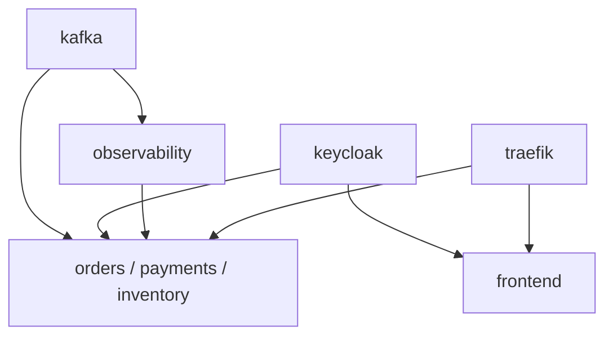

# Helmfile

## Rôle

Helmfile décrit les releases Helm et leurs dépendances. Il évite de lancer manuellement huit installations indépendantes et centralise la sélection de l'environnement `dev`.

Le fichier source est `infra/helm/helmfile.yaml.gotmpl`.

## Environnement

L'environnement déclaré est `dev` :

```yaml
environments:
  dev:
    values:
      - environments/dev/environment.yaml
```

`environment.yaml` contient actuellement `environment: dev`. Les valeurs des releases sont ensuite chargées depuis `environments/{{ .Environment.Name }}/`.

## Releases et dépendances



Les services métier déclarent des dépendances vers Kafka, Keycloak, observability et Traefik. Le frontend dépend de Keycloak et de Traefik.

## Paramètres Helmfile actuels

```yaml
helmDefaults:
  wait: false
  timeout: 600
  atomic: false
  cleanupOnFail: false
  createNamespace: false
```

Conséquences :

- Helmfile ne vérifie pas automatiquement que les workloads sont prêts avant de rendre la commande ;
- un échec ne déclenche pas de rollback atomique ;
- les namespaces doivent être préparés séparément ;
- le timeout configuré est de 600 secondes pour les opérations Helm qui l'utilisent.

## Préparation locale

Les charts applicatifs référencent la library chart `common` sous forme d'archive dans leur sous-répertoire `charts/`. Les dépendances doivent être présentes avant le rendu ; la commande de synchronisation de dépendances est à exécuter depuis le dossier du chart concerné si l'archive n'est pas disponible.

Le script racine `deploy-images.sh` construit les quatre images applicatives dans le daemon Docker de Minikube. Les valeurs dev utilisent ensuite `IfNotPresent`, ce qui évite un pull externe pour ces images locales.

## Commandes de référence

Les commandes ci-dessous sont des exemples opératoires à exécuter après préparation du cluster et des namespaces :

```bash
cd infra/helm
helmfile -e dev template
helmfile -e dev diff
helmfile -e dev sync
```

`template` produit le rendu sans l'appliquer. `diff` compare l'état attendu et l'état présent si le plugin correspondant est installé. `sync` applique les releases dans l'ordre défini par Helmfile.

La documentation ne lance pas ces commandes sur un cluster : elles peuvent modifier l'environnement Kubernetes.

## Vérifications post-déploiement

```bash
kubectl get pods -n ecommerce
kubectl get pods -n ingress-system
kubectl get ingress -n ecommerce
kubectl get svc -n ingress-system
```

Vérifier notamment que :

- Kafka et Keycloak sont prêts ;
- le Job de création des topics s'est terminé ;
- Traefik possède une `IngressClass` `traefik` et un service `NodePort` exposant `30080` ;
- les Ingress applicatifs ciblent les services attendus.

## Références

- [Helm](helm.md)
- [Kubernetes](kubernetes.md)
- [Minikube](../development/minikube.md)
