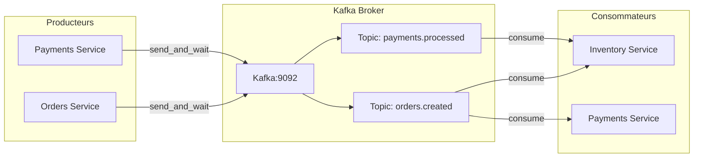

# Apache Kafka - Message Broker

## Vue d'ensemble

**Apache Kafka** sert de broker de messages pour la communication asynchrone entre les microservices. Il permet la publication et la consommation d'événements métier.

Le dépôt propose deux configurations : Kafka est lancé par Docker Compose avec le nom `kafka:9092`, ou par le chart Helm sous forme de `StatefulSet` KRaft. Les deux configurations sont mono-nœud et utilisent du trafic `PLAINTEXT` en développement.

### Rôles de Kafka

1. **Event Bus** : Centralise tous les événements du système
2. **Buffer** : Tamponne les messages entre producteurs et consommateurs
3. **Persistence** : Stocke les événements pour replay possible
4. **Découplage** : Sépare les producteurs des consommateurs

## Configuration

### Image et Version

```yaml
image: apache/kafka:4.0.2
```

### Mode KRaft (sans ZooKeeper)

Kafka 4.0 utilise KRaft, un mode opérationnel sans ZooKeeper :

```yaml
environment:
  KAFKA_NODE_ID: 1
  KAFKA_PROCESS_ROLES: broker,controller
  KAFKA_CONTROLLER_QUORUM_VOTERS: 1@kafka:9093
```

**Explications** :

| Variable | Description |
|----------|-------------|
| `KAFKA_NODE_ID` | Identifiant unique du nœud |
| `KAFKA_PROCESS_ROLES` | Rôles du nœud (broker + controller) |
| `KAFKA_CONTROLLER_QUORUM_VOTERS` | Liste des nœuds controller |

### Configuration des Listeners

```yaml
KAFKA_LISTENERS: PLAINTEXT://:9092,CONTROLLER://:9093
KAFKA_ADVERTISED_LISTENERS: PLAINTEXT://kafka:9092
KAFKA_LISTENER_SECURITY_PROTOCOL_MAP: CONTROLLER:PLAINTEXT,PLAINTEXT:PLAINTEXT
KAFKA_CONTROLLER_LISTENER_NAMES: CONTROLLER
KAFKA_INTER_BROKER_LISTENER_NAME: PLAINTEXT
```

**Listeners** :
- `PLAINTEXT://:9092` : Écoute les clients (producteurs/consumers)
- `CONTROLLER://:9093` : Communication inter-nœuds KRaft

### Création Automatique des Topics

```yaml
KAFKA_AUTO_CREATE_TOPICS_ENABLE: "true"
```

Dans Docker Compose, Kafka autorise la création automatique des topics. Dans Kubernetes, le chart exécute un Job Helm post-install/post-upgrade qui crée explicitement `orders.created` et `payments.processed` avec une partition et un facteur de réplication égal à 1.

### Configuration Kubernetes

Le chart `infra/helm/kafka` utilise :

| Élément | Valeur |
|---------|--------|
| Type de workload | `StatefulSet` |
| Replicas | 1 |
| Service | Headless `kafka` |
| Stockage dev | PVC de `2Gi` |
| Cluster ID | Secret `kafka-cluster-id` |
| DNS advertised | `kafka-0.kafka.ecommerce.svc.cluster.local:9092` |
| Bootstrap utilisé par les applications | `kafka:9092` |

Le service headless est nécessaire à l'identité réseau stable du StatefulSet. Les applications utilisent le service `kafka` comme bootstrap ; Kafka annonce ensuite l'identité stable du broker.

### Configuration du Cluster

```yaml
KAFKA_OFFSETS_TOPIC_REPLICATION_FACTOR: 1
CLUSTER_ID: "5L6g3nShT-eMCtK--X86sw"
```

**Note** : `replication_factor: 1` car c'est un cluster single-node (dev).

## Health Check

```yaml
healthcheck:
  test: ["CMD", "/opt/kafka/bin/kafka-broker-api-versions.sh", "--bootstrap-server", "localhost:9092"]
  interval: 15s
  timeout: 10s
  retries: 10
  start_period: 40s
```

Le health check vérifie que le broker répond aux requêtes API.

## Topics

### Topics Créés

| Topic | Description | Producteur | Consommateurs |
|-------|-------------|------------|---------------|
| `orders.created` | Nouvelle commande créée | Orders Service | Inventory, Payments |
| `payments.processed` | Paiement validé | Payments Service | Inventory |

### Structure d'un Message

```json
{
  "order_id": "uuid-v4",
  "product_id": "string",
  "quantity": "integer",
  "customer_id": "string",
  "status": "string",
  "amount": "float"
}
```

## Kafka UI

### Configuration

```yaml
kafka-ui:
  image: provectuslabs/kafka-ui:latest
  environment:
    - KAFKA_CLUSTERS_0_NAME=ecommerce-cluster
    - KAFKA_CLUSTERS_0_BOOTSTRAPSERVERS=kafka:9092
```

### Accès

```
http://localhost:8081
```

### Fonctionnalités

1. **Clusters** : Vue d'ensemble du cluster
2. **Topics** : Liste et détails des topics
3. **Messages** : Visualisation des messages
4. **Consumers** : État des consumer groups
5. **Partitions** : Répartition des données

### Exemple de Vue

```
Cluster: ecommerce-cluster
  Topics:
    - orders.created (partitions: 1, messages: 150)
    - payments.processed (partitions: 1, messages: 120)
  
  Consumer Groups:
    - inventory-group (lag: 0)
    - payment-group (lag: 0)
```

## Configuration des Producteurs

### Exemple dans Orders Service

```python
from aiokafka import AIOKafkaProducer

producer = AIOKafkaProducer(
    bootstrap_servers='kafka:9092',
    value_serializer=lambda v: json.dumps(v).encode('utf-8')
)

await producer.start()

# Envoi d'un message
await producer.send_and_wait("orders.created", event_message)
```

**Configuration** :
- `bootstrap_servers` : Adresse du broker
- `value_serializer` : Sérialisation JSON

## Configuration des Consumers

### Exemple dans Inventory Service

```python
from aiokafka import AIOKafkaConsumer

consumer = AIOKafkaConsumer(
    'orders.created', 'payments.processed',
    bootstrap_servers='kafka:9092',
    group_id='inventory-group',
    auto_offset_reset="earliest",
)

await consumer.start()

async for msg in consumer:
    topic = msg.topic
    data = json.loads(msg.value.decode('utf-8'))
    # Traitement du message
```

**Configuration** :
- `group_id` : Consumer group pour le load balancing
- `auto_offset_reset` : Position initiale (earliest/latest)

## Consumer Groups

| Group ID | Service | Topics Écoutés |
|----------|---------|----------------|
| `inventory-group` | Inventory | orders.created, payments.processed |
| `payment-group` | Payments | orders.created |

## Ports Exposés

| Port | Usage |
|------|-------|
| 9092 | Broker (clients) |

## Architecture



## Monitoring

### Via Kafka UI

- Nombre de messages par topic
- Lag des consumers
- Taille des messages
- Offset actuel

### Via Logs

```bash
docker compose -f infra/docker-compose.yml logs -f kafka
```

### Commandes CLI

```bash
# Lister les topics
docker exec kafka kafka-topics.sh --bootstrap-server localhost:9092 --list

# Décrire un topic
docker exec kafka kafka-topics.sh --bootstrap-server localhost:9092 --describe --topic orders.created

# Consommer des messages
docker exec -it kafka kafka-console-consumer.sh --bootstrap-server localhost:9092 --topic orders.created --from-beginning
```

## Limitations Connues

1. **Single broker** : Pas de haute disponibilité
2. **Pas de replication** : Perte des données en cas de crash
3. **Partitionnement** : 1 partition par topic (pas de parallelisme)
4. **Persistance** : PVC de développement uniquement dans le chart Helm ; le parcours Compose ne monte pas de volume Kafka
5. **Sécurité** : Pas d'authentification/autorisation

## Pour la Production

- Ajouter des brokers supplémentaires
- Configurer la replication (min.insync.replicas >= 2)
- Mettre en place SASL/SSL pour la sécurité
- Configurer les quotas de débit
- Ajouter des topics de dead letter queue
- Implémenter le schema registry (Avro/Protobuf)
