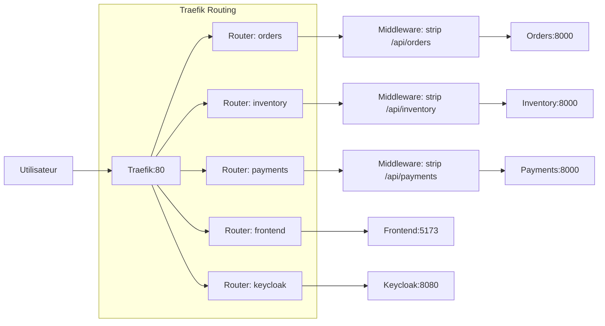

# Traefik - API Gateway

## Vue d'ensemble

**Traefik** sert de routeur inverse et d'API Gateway pour toute la plateforme. Dans Docker Compose, il route les requêtes grâce aux labels Docker. Dans Kubernetes, il lit des objets `Ingress` classiques via le provider `kubernetesIngress`.

### Rôles de Traefik

1. **Routing** : Dirige les requêtes vers les bons services
2. **Strip Prefix** : Supprime les préfixes d'API avant forwarding
3. **Service Discovery** : Découvre les services via Docker ou Kubernetes selon le provider
4. **Dashboard** : Interface de monitoring et configuration

## Configuration

### Image et Version

```yaml
image: traefik:v3.6
```

### Commande de Démarrage

```yaml
command:
  - "--api.insecure=true"
  - "--providers.docker=true"
  - "--providers.docker.exposedbydefault=false"
  - "--entrypoints.web.address=:80"
```

**Explications** :

| Option | Description |
|--------|-------------|
| `api.insecure=true` | Active le dashboard (désactiver en production) |
| `providers.docker=true` | Utilise Docker comme provider de configuration |
| `exposedbydefault=false` | Seul les services avec `traefik.enable=true` sont exposés |
| `entrypoints.web.address=:80` | Écoute sur le port 80 |

### Volumes

```yaml
volumes:
  - /var/run/docker.sock:/var/run/docker.sock:ro
```

Permet à Traefik de lire les métadonnées Docker (labels) pour la découverte de services.

## Configuration des Routes

### Orders Service

```yaml
labels:
  - "traefik.enable=true"
  - "traefik.http.routers.orders.rule=PathPrefix(`/api/orders`)"
  - "traefik.http.middlewares.orders-strip.stripprefix.prefixes=/api/orders"
  - "traefik.http.routers.orders.middlewares=orders-strip"
  - "traefik.http.services.orders.loadbalancer.server.port=8000"
```

**Flux** :
1. Requête arrive sur `http://localhost/api/orders/...`
2. Traefik matche le router `orders` (PathPrefix)
3. Middleware `orders-strip` retire `/api/orders`
4. Requête forwardée vers le service sur `/...`

### Inventory Service

```yaml
labels:
  - "traefik.enable=true"
  - "traefik.http.routers.inventory.rule=PathPrefix(`/api/inventory`)"
  - "traefik.http.middlewares.inventory-strip.stripprefix.prefixes=/api/inventory"
  - "traefik.http.routers.inventory.middlewares=inventory-strip"
  - "traefik.http.services.inventory.loadbalancer.server.port=8000"
```

### Payments Service

```yaml
labels:
  - "traefik.enable=true"
  - "traefik.http.routers.payments.rule=PathPrefix(`/api/payments`)"
  - "traefik.http.middlewares.payments-strip.stripprefix.prefixes=/api/payments"
  - "traefik.http.routers.payments.middlewares=payments-strip"
  - "traefik.http.services.payments.loadbalancer.server.port=8000"
```

### Frontend

```yaml
labels:
  - "traefik.enable=true"
  - "traefik.http.routers.frontend.rule=PathPrefix(`/`)"
  - "traefik.http.services.frontend.loadbalancer.server.port=5173"
```

**Note** : Pas de strip prefix pour le frontend (root path).

### Keycloak

```yaml
labels:
  - "traefik.enable=true"
  - "traefik.http.routers.keycloak.entrypoints=web"
  - "traefik.http.routers.keycloak.rule=PathPrefix(`/auth`)"
  - "traefik.http.services.keycloak.loadbalancer.server.port=8080"
```

**Note** : Keycloak utilise le chemin relatif `/auth` configuré dans ses variables d'environnement.

## Configuration Kubernetes

Le chart `infra/helm/traefik-config` déploie le chart officiel Traefik avec la configuration dev suivante :

```yaml
providers:
  kubernetesCRD:
    enabled: false
  kubernetesIngress:
    enabled: true
    ingressClass: traefik
service:
  type: NodePort
ports:
  web:
    exposedPort: 80
    nodePort: 30080
```

L'`IngressClass` `traefik` est activée et définie par défaut. Le dashboard Traefik est désactivé dans les valeurs Helm dev ; l'URL `http://localhost:8090` concerne uniquement Docker Compose.

Les charts des applications créent des Ingress avec l'annotation `kubernetes.io/ingress.class: traefik`. Les routes Kubernetes sont documentées dans [Ingress et DNS](ingress-dns.md). Les templates Kubernetes ne configurent pas les middlewares Docker `StripPrefix` : il faut donc valider le comportement des préfixes `/api/...` avec les `root_path` FastAPI après déploiement.

## Dashboard Traefik

### Accès

```
http://localhost:8090
```

Le port 8090 est mappé sur le port 8080 interne de Traefik.

### Sections du Dashboard

1. **Dashboard** : Vue d'ensemble
2. **HTTP Routers** : Liste des routes configurées
3. **HTTP Services** : Liste des services backend
4. **HTTP Middlewares** : Liste des middlewares
5. **Access** : Logs d'accès en temps réel

### Exemple de Vue

```
Router: orders
  Rule: PathPrefix(`/api/orders`)
  Service: orders (1 server up)
  Middleware: orders-strip
  
Router: frontend
  Rule: PathPrefix(`/`)
  Service: frontend (1 server up)
```

## Architecture du Routing



## Table de Routing Docker Compose

| Chemin d'entrée | Router | Middleware | Service Backend | Port |
|-----------------|--------|------------|-----------------|------|
| `/api/orders/*` | orders | strip `/api/orders` | orders | 8000 |
| `/api/inventory/*` | inventory | strip `/api/inventory` | inventory | 8000 |
| `/api/payments/*` | payments | strip `/api/payments` | payments | 8000 |
| `/*` | frontend | - | frontend | 5173 |
| `/auth/*` | keycloak | - | keycloak | 8080 |

## Table de Routing Kubernetes

| Chemin d'entrée | Objet Ingress | Service Kubernetes | Port |
|-----------------|---------------|--------------------|------|
| `/api/orders/*` | `orders` | `orders` | 8000 |
| `/api/inventory/*` | `inventory` | `inventory` | 8000 |
| `/api/payments/*` | `payments` | `payments` | 8000 |
| `/*` | `frontend` | `frontend` | 5173 |
| `/auth/*` | `keycloak` | `keycloak` | 8080 |

Les hosts sont absents des valeurs dev. Le routage Kubernetes est donc basé sur le chemin et l'`IngressClass`, pas sur un hostname imposé.

## Ports Exposés

| Port | Usage |
|------|-------|
| 80 | API publique (HTTP) |
| 8090 | Dashboard Traefik |

## Sécurité

### Pour la Production

```yaml
# Désactiver le dashboard public
- "--api.insecure=false"

# Ajouter l'authentification
- "--api.dashboard=true"
- "--api.insecure=false"
- "--entrypoints.web.http.middlewares=auth"
- "--entrypoints.web.http.basicAuth.users=admin:$$apr1$$...$$"

# Activer HTTPS
- "--entrypoints.websecure.address=:443"
- "--certificatesresolvers.myresolver.acme.tlschallenge=true"
- "--certificatesresolvers.myresolver.acme.email=admin@example.com"
```

## Logs et Debug

### Logs Traefik

```bash
docker compose -f infra/docker-compose.yml logs -f traefik
```

### Exemple de Log

```
time="2024-07-23T10:00:00Z" level=info msg="Configuration loaded from Docker"
time="2024-07-23T10:00:01Z" level=debug msg="Trying to download configuration"
```

## Troubleshooting

### Service non détecté

Vérifier que le service a les labels corrects :

```bash
docker inspect <service> | grep traefik
```

### Route non matchée

Vérifier le dashboard Traefik pour voir les routes actives.

### Middleware non appliqué

Vérifier l'orthographe des noms de middleware dans les labels.

## Limitations Connues

1. **HTTP uniquement** : Pas de HTTPS configuré
2. **Pas de rate limiting** : Pas de protection DDoS
3. **Dashboard exposé** : Accessible sans auth (dev only)
4. **Pas de load balancing** : Un seul backend par service
5. **Pas de caching** : Pas de cache HTTP configuré
