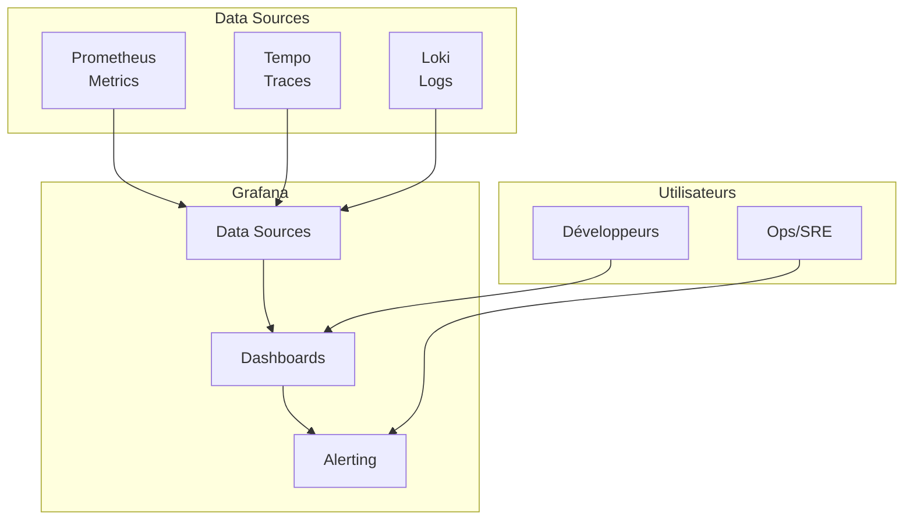

# Grafana - Visualisation

## Vue d'ensemble

**Grafana** est la plateforme de visualisation unifiée qui agrège les données de Prometheus (metrics), Tempo (traces) et Loki (logs) dans des dashboards interactifs.

Les exemples de volume et de dashboard JSON de cette page concernent Docker Compose. Le chart Helm actuel configure les datasources et l'accès anonyme, mais ne provisionne pas `infra/otel/ecommerce.json`.

## Architecture



## Configuration

### Image et Version

```yaml
image: grafana/grafana:latest
```

### Variables d'Environnement

```yaml
environment:
  - GF_AUTH_ANONYMOUS_ENABLED=true
  - GF_AUTH_ANONYMOUS_ORG_ROLE=Admin
```

**Note** : Authentification désactivée pour le développement.

### Volumes

```yaml
volumes:
  - ./otel/datasources.yml:/etc/grafana/provisioning/datasources/datasources.yml
  - ./otel/dashboards.yml:/etc/grafana/provisioning/dashboards/dashboards.yml
  - ./otel/ecommerce.json:/var/lib/grafana/dashboards/ecommerce.json
```

Dans Kubernetes, le chart `infra/helm/observability` ne monte pas ces trois fichiers. Il monte uniquement une ConfigMap de datasources et expose Grafana par un service `ClusterIP`. Pour consulter Grafana sans ajouter d'Ingress, utiliser `kubectl port-forward -n ecommerce svc/grafana 3000:3000`.

## Data Sources Configurées

### Fichier de Provisioning

```yaml
# infra/otel/datasources.yml
apiVersion: 1

datasources:
  - name: Prometheus
    type: prometheus
    uid: prometheus
    url: http://prometheus:9090
    access: proxy
    isDefault: true

  - name: Tempo
    type: tempo
    uid: tempo
    url: http://tempo:3200
    access: proxy

  - name: Loki
    type: loki
    uid: loki
    url: http://loki:3100
    access: proxy
```

### Vérification

1. Aller dans **Configuration** → **Data Sources**
2. Vérifier que les 3 datasources sont présentes et vertes

## Dashboards

### Dashboard Principal Compose: "E-Commerce Control Tower"

**Fichier** : `infra/otel/ecommerce.json`

**Provisioning** :
```yaml
# infra/otel/dashboards.yml
providers:
  - name: 'default'
    orgId: 1
    folder: ''
    type: file
    disableDeletion: false
    updateIntervalSeconds: 10
    options:
      path: /var/lib/grafana/dashboards
```

Ce provisioning est présent dans `infra/docker-compose.yml`. Il n'est pas généré par le chart Helm actuel.

### Panneau 1: Flux des Événements (Logs)

**Type** : Logs

**Datasource** : Loki

**Requête** :
```logql
{service_name=~"orders|payments|inventory"}
```

**Options** :
- `showTime: true`
- `showLabels: false`
- `showCommonLabels: false`
- `wrapLogMessage: true`
- `sortOrder: Descending`

**Usage** : Visualiser en temps réel tous les logs des microservices

### Panneau 2: Requêtes HTTP par Service

**Type** : Time series

**Datasource** : Prometheus

**Requête** :
```promql
sum by (service_name) (rate(http_server_duration_milliseconds_count[1m]))
```

**Unité** : Requests/sec

**Usage** : Monitorer le trafic entrant par service

### Panneau 3: Ruptures de Stock Alertes

**Type** : Stat

**Datasource** : Loki

**Requête** :
```logql
count_over_time({service_name="inventory"} |= "RUPTURE" [1m])
```

**Couleurs** :
- Vert : 0 (seuil < 1)
- Rouge : >= 1 (seuil >= 1)

**Usage** : Alerte visuelle immédiate sur les ruptures de stock

## Accès au Dashboard

### URL

```
http://localhost:3000
```

### Navigation

1. **Dashboard** → **E-Commerce Control Tower**
2. Ou directement : `http://localhost:3000/d/ecommerce-main-dash`

### Time Range

- Par défaut : **Last 1 hour**
- Options : 5m, 15m, 30m, 1h, 6h, 12h, 24h
- **Auto refresh** : 5s (configuré dans le dashboard)

## Exploration de Données

### Explore - Logs

1. Cliquer sur **Explore** (icône boussole)
2. Sélectionner **Loki**
3. Entrer : `{service_name="orders"}`
4. Voir les logs en temps réel

### Explore - Metrics

1. Cliquer sur **Explore**
2. Sélectionner **Prometheus**
3. Entrer : `http_server_duration_milliseconds_count`
4. Voir le graphique et les valeurs

### Explore - Traces

1. Cliquer sur **Explore**
2. Sélectionner **Tempo**
3. Entrer un **Trace ID** ou chercher par service
4. Voir le diagramme de flux

## Corrélation Logs-Metrics-Traces

### Trace to Metrics

Dans une trace Tempo, cliquer sur un span pour voir les metrics associées :

```
Span: POST /api/orders/
  ↓
Metrics: http_server_duration_milliseconds_count{service_name="orders"}
```

### Trace to Logs

Dans une trace Tempo, voir les logs correspondants :

```logql
{trace_id="abc123..."}
```

### Logs to Trace

Dans les logs Loki, le `trace_id` est cliquable :

```
10:00:00 INFO [trace_id=abc123] Processing order...
                              ↑ cliquer pour voir la trace
```

## Création de Dashboards Personnalisés

### Exemple: Dashboard de Performance

1. **Create** → **Dashboard**
2. **Add visualization**
3. **Datasource** : Prometheus
4. **Requête** :
   ```promql
   sum by (service_name) (rate(http_server_duration_milliseconds_sum[1m])) /
   sum by (service_name) (rate(http_server_duration_milliseconds_count[1m]))
   ```
5. **Unit** : Milliseconds
6. **Save** : "Performance Dashboard"

### Exemple: Dashboard d'Alertes

1. **Create** → **Dashboard**
2. **Add visualization** → **Stat**
3. **Datasource** : Loki
4. **Requête** :
   ```logql
   sum(count_over_time({level="error"}[5m]))
   ```
5. **Thresholds** : 0 (green), 1 (red)
6. **Save** : "Error Monitoring"

## Alerting (Non Implémenté)

### Exemple d'Alerte

1. **Alerting** → **New alert rule**
2. **Datasource** : Loki
3. **Requête** :
   ```logql
   sum(count_over_time({service_name="inventory"} |= "RUPTURE"[1m]))
   ```
4. **Condition** : `> 0`
5. **Evaluation** : Every 1m
6. **Notification** : Email/Slack

## Variables de Dashboard

### Exemple: Variable de Service

```
Type: Query
Datasource: Loki
Query: label_values(service_name)
```

Utilisation dans les requêtes :
```logql
{service_name="$service"}
```

## Export de Dashboards

### Export JSON

1. Ouvrir un dashboard
2. **Dashboard settings** (icône engrenage)
3. **JSON Model**
4. Copier/exporter le JSON

### Import Dashboard

1. **Dashboards** → **Import**
2. Coller le JSON ou uploader un fichier
3. Sélectionner les datasources
4. **Import**

## Limitations Connues

1. **Anonymous access** : Pas d'authentification
2. **Pas de sauvegarde** : Dashboards dans le volume
3. **Single user** : Pas de gestion d'utilisateurs
4. **Pas d'alerting** : Non configuré
5. **Dashboard simple** : 3 panneaux seulement

## Pour la Production

```yaml
environment:
  # Authentification
  - GF_AUTH_ANONYMOUS_ENABLED=false
  - GF_SECURITY_ADMIN_USER=${GRAFANA_ADMIN}
  - GF_SECURITY_ADMIN_PASSWORD=${GRAFANA_PASSWORD}
  
  # Email pour alertes
  - GF_SMTP_ENABLED=true
  - GF_SMTP_HOST=smtp.example.com:587
  - GF_SMTP_USER=${SMTP_USER}
  - GF_SMTP_PASSWORD=${SMTP_PASSWORD}

volumes:
  - grafana_data:/var/lib/grafana  # Persistance
```

## Commandes Utiles

```bash
# Vérifier l'état
curl http://localhost:3000/api/health

# Lister les dashboards
curl http://localhost:3000/api/search

# Lister les datasources
curl http://localhost:3000/api/datasources

# Exporter un dashboard
curl http://localhost:3000/api/dashboards/uid/ecommerce-main-dash
```

## Bonnes Pratiques

### Organisation

- Utiliser des **folders** pour organiser les dashboards
- Créer des dashboards par équipe/service
- Documenter les requêtes complexes

### Performance

- Éviter les requêtes trop larges
- Utiliser des **variables** pour filtrer
- Configurer un **refresh interval** approprié

### Sécurité

- Activer l'authentification
- Configurer les **RBAC** (roles)
- Ne pas exposer Grafana publiquement
