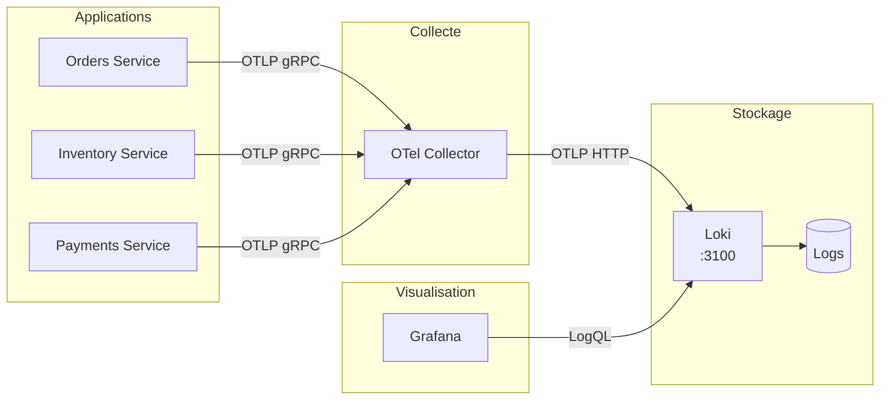

# Loki - Agrégation de Logs

## Vue d'ensemble

**Grafana Loki** est un système d'agrégation de logs conçu pour être léger, économique et facile à opérer. Il indexe les logs par labels (comme Prometheus) plutôt que par contenu.

Dans Docker Compose, Loki est publié sur `localhost:3100`. Dans Kubernetes, le chart `observability` l'expose uniquement par un service `ClusterIP` sur `3100` et ne configure pas de volume persistant dans l'environnement dev.

## Architecture



## Configuration

### OTel Collector Exporter

```yaml
# infra/otel/otel-collector-config.yaml
exporters:
  otlp_http/loki:
    endpoint: "http://loki:3100/otlp"

service:
  pipelines:
    logs:
      receivers: [otlp]
      processors: [batch]
      exporters: [otlp_http/loki]
```

### Loki Configuration

Loki utilise la configuration par défaut dans le Docker image :

```yaml
# Aucun fichier de configuration personnalisé
image: grafana/loki:latest
ports:
  - "3100:3100"
```

## Structure des Logs

### Format OTLP

```json
{
  "resourceLogs": [
    {
      "resource": {
        "attributes": [
          {"key": "service.name", "value": {"stringValue": "orders"}}
        ]
      },
      "scopeLogs": [
        {
          "logRecords": [
            {
              "timeUnixNano": 1721721600000000000,
              "severityText": "INFO",
              "body": {"stringValue": "Demarrage du service Orders..."},
              "attributes": [
                {"key": "customer_id", "value": {"stringValue": "user123"}}
              ]
            }
          ]
        }
      ]
    }
  ]
}
```

### Labels dans Loki

Les logs sont indexés par labels extraits des attributs :

```
{service_name="orders", level="info"}
{service_name="inventory", level="error"}
{service_name="payments", level="info"}
```

## Requêtes LogQL

### LogQL est le langage de requête de Loki.

### Requêtes de Base

#### Tous les logs d'un service

```logql
{service_name="orders"}
```

#### Logs avec un mot-clé

```logql
{service_name="orders"} |= "commande"
```

#### Logs excluant un mot-clé

```logql
{service_name="orders"} != "DEBUG"
```

#### Logs avec regex

```logql
{service_name="orders"} |= `order_id: [a-f0-9-]+`
```

### Requêtes Avancées

#### Compter les logs par niveau

```logql
sum by (level) (count_over_time({service_name="orders"}[5m]))
```

#### Trouver les erreurs

```logql
{service_name=~"orders|payments|inventory"} |= "ERROR" |= "exception"
```

#### Taux de logs par seconde

```logql
sum(rate({service_name="orders"}[1m]))
```

#### Logs avec extraction de champs

```logql
{service_name="orders"} | pattern `<time> - <level> - <message> (order_id: <order_id>)`
```

#### Agrégation après extraction

```logql
sum by (order_id) (count_over_time({service_name="orders"} | pattern `<order_id>`[5m]))
```

### Requêtes Spécifiques

#### Ruptures de stock

```logql
{service_name="inventory"} |= "RUPTURE"
```

#### Commandes créées

```logql
{service_name="orders"} |= "Evenement publie"
```

#### Paiements validés

```logql
{service_name="payments"} |= "Paiement simulé"
```

#### Erreurs Kafka

```logql
{service_name=~"orders|payments|inventory"} |= "Kafka" |= "Erreur"
```

## Intégration avec Grafana

### Data Source

```yaml
# infra/otel/datasources.yml
- name: Loki
  type: loki
  uid: loki
  url: http://loki:3100
  access: proxy
```

### Explorer Logs dans Grafana

1. Aller dans **Explore**
2. Sélectionner la datasource **Loki**
3. Entrer une requête LogQL
4. Voir les logs en temps réel

### Exemple de Vue

```
┌─────────────────────────────────────────────────────┐
│ {service_name="orders"}                             │
├─────────────────────────────────────────────────────┤
│ 10:00:00.000  INFO  Demarrage du service Orders...  │
│ 10:00:01.000  INFO  Producer Kafka connecte...      │
│ 10:00:05.000  INFO  Requete de creation...          │
│ 10:00:05.001  INFO  Evenement publie...             │
└─────────────────────────────────────────────────────┘
```

## Dashboard Grafana - Logs Combinés

### Panneau: "Flux des Événements"

**Requête** :
```logql
{service_name=~"orders|payments|inventory"}
```

**Options** :
- `showTime: true` : Afficher l'horodatage
- `wrapLogMessage: true` : Wrap des lignes longues
- `sortOrder: Descending` : Plus récent en premier

### Panneau: "Ruptures de Stock Alertes"

**Requête** :
```logql
count_over_time({service_name="inventory"} |= "RUPTURE" [1m])
```

**Type** : Stat (valeur unique)

**Couleurs** :
- Vert : 0 (pas de rupture)
- Rouge : >= 1 (rupture détectée)

## Filtrage et Agrégation

### Filtrer par niveau

```logql
{service_name="orders"} | level="error"
```

### Compter les occurrences

```logql
count_over_time({service_name="orders"} |= "commande" [1h])
```

### Regrouper par champ

```logql
sum by (customer_id) (count_over_time({service_name="orders"} | pattern `<customer_id>`[1h]))
```

### Jointure avec Metrics

```logql
# Logs d'erreur
{service_name="orders"} |= "ERROR"

# Puis voir les metrics associées
# (via Trace to Metrics dans Grafana)
```

## Bonnes Pratiques

### Structurer les Logs

```python
# Bon - Log structuré avec contexte
logger.info(f"Requete recue (Client: {customer_id}, Produit: {product_id})")

# Mauvais - Log sans contexte
logger.info("Requete recue")
```

### Labels Appropriés

```python
# Ajouter des labels pertinents
logger.info("Message", extra={
    "order_id": order_id,
    "customer_id": customer_id
})
```

### Niveaux de Log

```python
DEBUG  # Détails pour débogage
INFO   # Informations normales
WARN   # Avertissements
ERROR  # Erreurs non fatales
FATAL  # Erreurs critiques
```

### Éviter les Données Sensibles

```python
# Ne jamais logger
logger.error(f"Password: {password}")  # ❌
logger.error(f"User: {user_id}")       # ✅
```

## Recherche de Problèmes

### Erreurs Récentes

```logql
{service_name=~"orders|payments|inventory"} | level="error" | line_format "{{.message}}"
```

### Patterns d'Erreur

```logql
{service_name="inventory"} | pattern `<time> - <level> - <message>`
| line_format "{{.message}}"
| line_format "ALERT: {{.message}}"
```

### Logs par Service

```logql
sum by (service_name) (count_over_time({service_name=~".+"}[5m]))
```

## Limitations Connues

1. **Pas d'index complet** : Seul les labels sont indexés
2. **Recherche texte lente** : Full-text scan pour les filtres
3. **Stockage local** : Données volatiles
4. **Pas de retention** : Logs perdus au redémarrage
5. **Compression** : Non optimisée pour dev

## Pour la Production

```yaml
# Configuration production
auth_enabled: false

server:
  http_listen_port: 3100

schema_config:
  configs:
    - from: 2024-01-01
      store: boltdb-shipper
      object_store: s3
      schema: v13
      index:
        prefix: index_
        period: 24h

storage_config:
  boltdb_shipper:
    active_index_directory: /tmp/loki/index
    cache_location: /tmp/loki/cache
    shared_store: s3
  s3:
    endpoint: s3.amazonaws.com
    bucketname: my-logs-bucket
    access_key: ${AWS_ACCESS_KEY}
    secret_key: ${AWS_SECRET_KEY}

compactor:
  working_directory: /tmp/loki/compactor
  shared_store: s3

limits_config:
  retention_period: 720h  # 30 jours
```

## Commandes Utiles

```bash
# Vérifier l'état
curl http://localhost:3100/ready

# Lister les labels
curl http://localhost:3100/loki/api/v1/labels

# Lister les valeurs d'un label
curl http://localhost:3100/loki/api/v1/label/service_name/values

# Requête via API
curl -G 'http://localhost:3100/loki/api/v1/query' \
  --data-urlencode 'query={service_name="orders"}'
```
