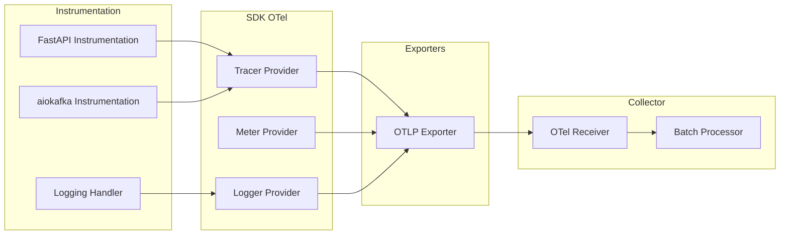
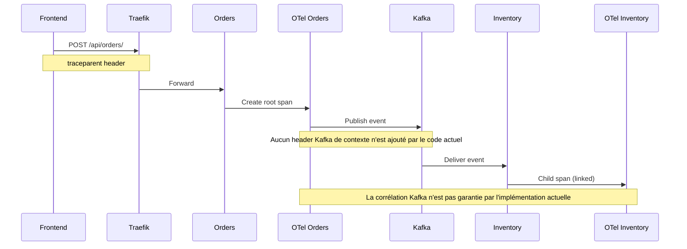

# OpenTelemetry - Configuration

## Vue d'ensemble

**OpenTelemetry (OTel)** est le framework unifié pour la collecte et l'export de télémétrie (logs, metrics, traces). Chaque microservice intègre le SDK Python OpenTelemetry.

Les trois services configurent actuellement un export OTLP/gRPC vers `http://otel-collector:4317`. Cette adresse est valable dans le réseau Docker Compose et dans le namespace Kubernetes `ecommerce` grâce au service `otel-collector`.

## Architecture OTel



## Configuration dans les Services

### 1. Resource Attributes

Identifie le service dans les données de télémétrie :

```python
from opentelemetry.sdk.resources import Resource

resource = Resource(attributes={"service.name": "orders"})
# Pour inventory: "service.name": "inventory"
# Pour payments: "service.name": "payments"
```

### 2. Configuration des Traces

```python
from opentelemetry import trace
from opentelemetry.sdk.trace import TracerProvider
from opentelemetry.sdk.trace.export import BatchSpanProcessor
from opentelemetry.exporter.otlp.proto.grpc.trace_exporter import OTLPSpanExporter

tracer_provider = TracerProvider(resource=resource)
tracer_exporter = OTLPSpanExporter(
    endpoint="http://otel-collector:4317",
    insecure=True
)
tracer_provider.add_span_processor(BatchSpanProcessor(tracer_exporter))
trace.set_tracer_provider(tracer_provider)
```

**Détails** :
- `TracerProvider` : Fournisseur de tracers
- `OTLPSpanExporter` : Exporte les spans via gRPC
- `BatchSpanProcessor` : Batch des spans avant export

### 3. Configuration des Logs

```python
from opentelemetry.sdk._logs import LoggerProvider, LoggingHandler
from opentelemetry.sdk._logs.export import BatchLogRecordProcessor
from opentelemetry.exporter.otlp.proto.grpc._log_exporter import OTLPLogExporter

log_provider = LoggerProvider(resource=resource)
log_exporter = OTLPLogExporter(
    endpoint="http://otel-collector:4317",
    insecure=True
)
log_provider.add_log_record_processor(BatchLogRecordProcessor(log_exporter))
handler = LoggingHandler(logger_provider=log_provider)

logging.basicConfig(level=logging.INFO)
logger = logging.getLogger("orders")
logger.addHandler(handler)
```

**Détails** :
- `LoggerProvider` : Fournisseur de loggers
- `OTLPLogExporter` : Exporte les logs via gRPC
- `LoggingHandler` : Intègre avec Python logging

### 4. Configuration des Metrics

```python
from opentelemetry import metrics
from opentelemetry.sdk.metrics import MeterProvider
from opentelemetry.sdk.metrics.export import PeriodicExportingMetricReader
from opentelemetry.exporter.otlp.proto.grpc.metric_exporter import OTLPMetricExporter

metric_exporter = OTLPMetricExporter(
    endpoint="http://otel-collector:4317",
    insecure=True
)
metric_reader = PeriodicExportingMetricReader(metric_exporter)
meter_provider = MeterProvider(resource=resource, metric_readers=[metric_reader])
metrics.set_meter_provider(meter_provider)
```

**Détails** :
- `MeterProvider` : Fournisseur de meters
- `OTLPMetricExporter` : Exporte les metrics via gRPC
- `PeriodicExportingMetricReader` : Export périodique

### 5. Instrumentation FastAPI

```python
from opentelemetry.instrumentation.fastapi import FastAPIInstrumentor

FastAPIInstrumentor.instrument_app(
    app,
    tracer_provider=tracer_provider,
    meter_provider=meter_provider
)
```

**Ce que ça instrumente** :
- Requêtes HTTP (spans automatiques)
- Durées de réponse
- Codes de statut
- Exceptions

## OTel Collector Configuration

### Fichier de Configuration

```yaml
# Docker Compose : infra/otel/otel-collector-config.yaml
receivers:
  otlp:
    protocols:
      grpc:
        endpoint: 0.0.0.0:4317
      http:
        endpoint: 0.0.0.0:4318

processors:
  batch:

exporters:
  prometheus:
    endpoint: "0.0.0.0:8889"
  otlp/tempo:
    endpoint: "tempo:4317"
    tls:
      insecure: true
  otlp_http/loki:
    endpoint: "http://loki:3100/otlp"

service:
  pipelines:
    traces:
      receivers: [otlp]
      processors: [batch]
      exporters: [otlp/tempo]
    metrics:
      receivers: [otlp]
      processors: [batch]
      exporters: [prometheus]
    logs:
      receivers: [otlp]
      processors: [batch]
      exporters: [otlp_http/loki]
```

Dans Kubernetes, la même logique est rendue par le chart `infra/helm/observability` depuis `values.yaml` et stockée dans une ConfigMap.

### Explication des Pipelines

#### Traces Pipeline

```yaml
traces:
  receivers: [otlp]           # Reçoit via OTLP gRPC/HTTP
  processors: [batch]          # Batch des spans
  exporters: [otlp/tempo]      # Export vers Tempo
```

#### Metrics Pipeline

```yaml
metrics:
  receivers: [otlp]            # Reçoit via OTLP gRPC/HTTP
  processors: [batch]          # Batch des metrics
  exporters: [prometheus]      # Export format Prometheus
```

#### Logs Pipeline

```yaml
logs:
  receivers: [otlp]            # Reçoit via OTLP gRPC/HTTP
  processors: [batch]          # Batch des logs
  exporters: [otlp_http/loki]  # Export via HTTP vers Loki
```

## Types de Données Collectées

### Traces

**Exemple de Span** :

```json
{
  "trace_id": "abc123...",
  "span_id": "def456...",
  "name": "POST /api/orders/",
  "kind": "SERVER",
  "start_time": "2024-07-23T10:00:00Z",
  "end_time": "2024-07-23T10:00:00.050Z",
  "attributes": {
    "http.method": "POST",
    "http.url": "/api/orders/",
    "http.status_code": 201,
    "service.name": "orders"
  }
}
```

### Metrics

**Exemple de Metric** :

```
http_server_duration_milliseconds_count{service_name="orders",http_method="POST",http_url="/api/orders/"} 150
http_server_duration_milliseconds_sum{service_name="orders",http_method="POST",http_url="/api/orders/"} 7500.0
```

### Logs

**Exemple de Log** :

```json
{
  "timestamp": "2024-07-23T10:00:00Z",
  "severity": "INFO",
  "body": "Requete de creation de commande recue",
  "attributes": {
    "service.name": "orders",
    "customer_id": "user123",
    "product_id": "LAPTOP-001"
  }
}
```

## Instrumentation Automatique

### FastAPI Instrumentation

Crée automatiquement des spans pour :
- Chaque requête HTTP
- Durée de traitement
- Exceptions levées
- Headers de trace (W3C)

### Attributes Injectés

```python
# Attributes automatiques
http.method = "POST"
http.url = "/api/orders/"
http.status_code = 201
http.server_name = "uvicorn"
net.host.port = 8000
```

## Propagation de Contexte

### W3C Trace Context

L'instrumentation HTTP peut utiliser les headers W3C pour propager le contexte :

```
traceparent: 00-0af7651916cd43dd8448eb211c80319c-b7ad6b7169203331-01
```

Format : `version-trace_id-span_id-flags`

### Entre Services



## Débogage

### Vérifier l'Export

```bash
# Logs du collector
docker compose -f infra/docker-compose.yml logs -f otel-collector
```

### Tester l'Export

```bash
# Envoyer un test via OTLP
curl -X POST http://localhost:4318/v1/traces \
  -H "Content-Type: application/json" \
  -d '{"resourceSpans":[]}'
```

## Limitations Connues

1. **Insecure gRPC** : `insecure=True` (HTTPS en prod)
2. **Pas de sampling** : 100% des traces exportées
3. **Batch non configuré** : Délai par défaut
4. **Pas de resource attributes** : Seulement `service.name`
5. **Logs non structurés** : Format texte simple

## Pour la Production

```python
# Sampling
from opentelemetry.sdk.trace.sampling import ParentBasedTraceIdRatio

tracer_provider = TracerProvider(
    resource=resource,
    sampler=ParentBasedTraceIdRatio(0.1)  # 10% des traces
)

# Batch avec configuration
BatchSpanProcessor(
    tracer_exporter,
    schedule_delay_millis=5000,
    max_export_batch_size=512,
    max_queue_size=2048
)

# Secure gRPC
OTLPSpanExporter(
    endpoint="https://otel-collector.example.com:4317",
    insecure=False,
    headers={"authorization": "Bearer <TOKEN>"}
)
```
