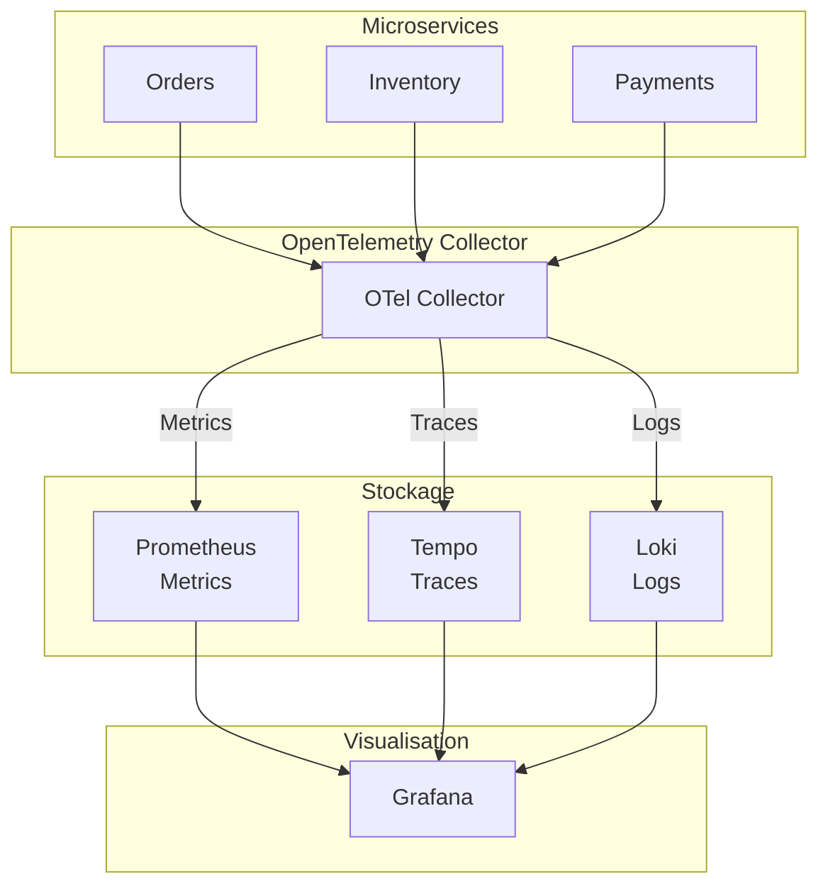
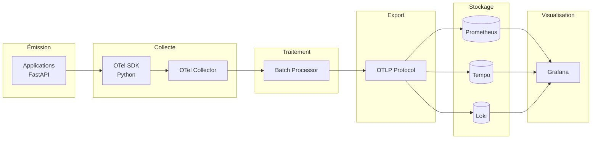
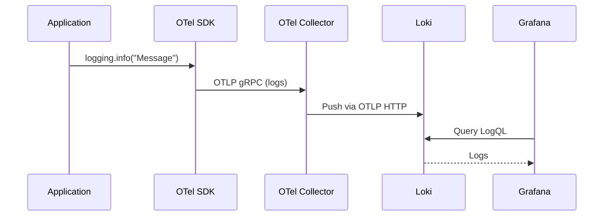
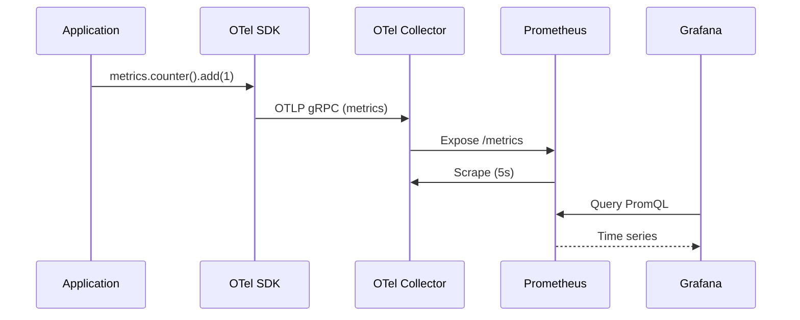
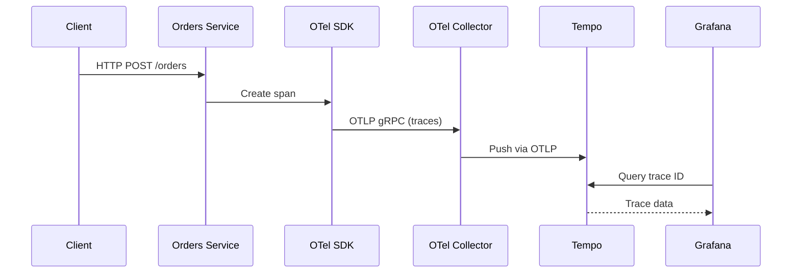

# Observabilité - Vue d'ensemble

## Introduction

L'observabilité est un pilier essentiel de cette architecture. Elle permet de comprendre le comportement interne du système en analysant ses sorties externes : **logs**, **metrics** et **traces**.

La configuration dépend du mode d'exécution. Docker Compose monte les fichiers de `infra/otel/` et provisionne le dashboard JSON. Le chart Helm `infra/helm/observability` recrée les composants avec des ConfigMaps générées par les valeurs Helm, expose uniquement des services `ClusterIP` et provisionne les trois datasources Grafana ; il ne monte pas actuellement `infra/otel/ecommerce.json` et ne rend donc pas le dashboard Compose automatiquement disponible.

## Les Trois Piliers de l'Observabilité



## Architecture de Télémétrie



## Composants de la Stack

### OpenTelemetry

**Rôle** : Standardisation de la collecte de télémétrie

- SDK dans chaque microservice (Python)
- Format unifié pour logs, metrics, traces
- Export via OTel Collector

### OpenTelemetry Collector

**Rôle** : Agrégation et routage des données

- Reçoit les données via OTLP (gRPC/HTTP)
- Traite (batch, filtering, enrichment)
- Exporte vers les backends appropriés

### Prometheus

**Rôle** : Base de données de metrics

- Time-series database
- Modèle pull (scrape) ou push
- Langage de requête PromQL
- Alerting

### Tempo

**Rôle** : Backend de traces distribuées

- Stockage optimisé pour traces
- Intégration native avec Grafana
- Recherche par trace ID, span name, etc.

### Loki

**Rôle** : Agrégateur de logs

- Indexation par labels (comme Prometheus)
- Compression efficace
- Langage LogQL pour requêtes

### Grafana

**Rôle** : Visualisation unifiée

- Dashboards personnalisés
- Requêtes multi-sources
- Alerting et notifications

### Différence Compose / Kubernetes

En Compose, les interfaces sont publiées sur les ports de l'hôte. En Kubernetes, Prometheus, Tempo, Loki et Grafana restent internes au namespace `ecommerce`. Pour une consultation ponctuelle, utiliser par exemple :

```bash
kubectl port-forward -n ecommerce svc/grafana 3000:3000
```

## Flux des Données

### Logs



### Metrics



### Traces



## Configuration Globale

### OTel Collector

```yaml
# infra/otel/otel-collector-config.yaml
receivers:
  otlp:
    protocols:
      grpc: endpoint: 0.0.0.0:4317
      http: endpoint: 0.0.0.0:4318

processors:
  batch:

exporters:
  prometheus: endpoint: "0.0.0.0:8889"
  otlp/tempo: endpoint: "tempo:4317", tls: insecure: true
  otlp_http/loki: endpoint: "http://loki:3100/otlp"

service:
  pipelines:
    traces:
      receivers: [otlp]
      processors: [batch]
      exporters: [otlp/tempo]
    metrics:
      receivers: [otlp]
      processors: [batch]
      exporters: [prometheus]
    logs:
      receivers: [otlp]
      processors: [batch]
      exporters: [otlp_http/loki]
```

## Ports d'Écoute

| Composant | Port | Protocol | Usage |
|-----------|------|----------|-------|
| OTel Collector (gRPC) | 4317 | OTLP/gRPC | Réception traces/metrics/logs |
| OTel Collector (HTTP) | 4318 | OTLP/HTTP | Réception traces/logs |
| OTel Collector (Metrics) | 8889 | Prometheus | Export metrics |
| Tempo | 3200 | HTTP | API traces |
| Tempo (OTLP) | 4317 | OTLP/gRPC | Réception traces |
| Loki | 3100 | HTTP/OTLP | API logs |
| Prometheus | 9090 | HTTP | API metrics |
| Grafana | 3000 | HTTP | UI |

## Dashboards Grafana

### Dashboard Principal: "E-Commerce Control Tower"

**Fichier** : `infra/otel/ecommerce.json`

Ce dashboard est provisionné par Docker Compose via `infra/otel/dashboards.yml`. Le chart Helm actuel ne contient pas de ConfigMap ou de volume pour ce fichier ; en Kubernetes, les datasources sont disponibles mais le dashboard doit être importé ou provisionné séparément.

**Panneaux** :

1. **Flux des Événements (Logs)**
   - Type: Logs
   - Datasource: Loki
   - Requête: `{service_name=~"orders|payments|inventory"}`

2. **Requêtes HTTP par Service**
   - Type: Time series
   - Datasource: Prometheus
   - Requête: `sum by (service_name) (rate(http_server_duration_milliseconds_count[1m]))`

3. **Ruptures de Stock Alertes**
   - Type: Stat
   - Datasource: Loki
   - Requête: `count_over_time({service_name="inventory"} |= "RUPTURE" [1m])`

## Datasources Grafana

Configurées automatiquement via provisioning :

```yaml
# infra/otel/datasources.yml
datasources:
  - name: Prometheus
    type: prometheus
    uid: prometheus
    url: http://prometheus:9090
    
  - name: Tempo
    type: tempo
    uid: tempo
    url: http://tempo:3200
    
  - name: Loki
    type: loki
    uid: loki
    url: http://loki:3100
```

## Labels et Tags

### Labels Communs

Toutes les données sont taguées avec :

- `service.name` : Nom du service (orders, inventory, payments)
- `service.version` : Version du service
- `telemetry.sdk.language` : python
- `telemetry.sdk.name` : opentelemetry

### Exemple de Log avec Labels

```
level=info service_name=orders message="Demarrage du service Orders..."
```

## Bonnes Pratiques

### Logs

- Utiliser des niveaux appropriés (INFO, WARN, ERROR)
- Inclure des contextes (order_id, user_id)
- Éviter les données sensibles (PII)
- Structurer les messages

### Metrics

- Utiliser des noms descriptifs
- Ajouter des labels pertinents
- Définir des alertes
- Documenter les métriques

### Traces

- Nommer clairement les spans
- Ajouter des attributs contextuels
- Propager le context entre services
- Échantillonner si nécessaire

## Accès aux Interfaces

| Interface | URL | Credentials |
|-----------|-----|-------------|
| Grafana Compose | http://localhost:3000 | Anonymous (Admin) |
| Prometheus | http://localhost:9090 | None |
| Tempo | http://localhost:3200 | None |
| Loki | http://localhost:3100 | None |

## Limitations Connues

1. **Anonymous access** : Grafana accessible sans auth
2. **Pas d'alerting** : Pas de configuration d'alertes
3. **Retention** : Données non persistantes (dev)
4. **Sampling** : 100% des traces (coûteux en prod)
5. **Scrape interval** : 5s (plus fréquent en prod)
