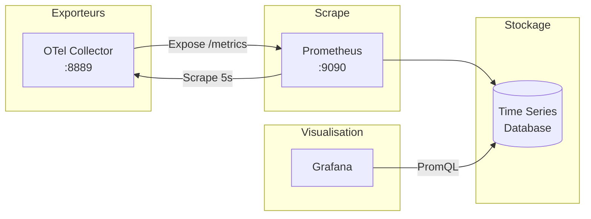

# Prometheus - Metrics

## Vue d'ensemble

**Prometheus** est le système de monitoring et d'alerting qui collecte et stocke les métriques de performance de la plateforme.

La configuration `infra/otel/prometheus.yml` et l'accès `http://localhost:9090` décrivent Docker Compose. Dans Kubernetes, le chart `observability` génère une ConfigMap équivalente, expose Prometheus en `ClusterIP` sur `9090` et ne configure pas de stockage persistant.

## Architecture



## Configuration

### Fichier de Configuration

```yaml
# infra/otel/prometheus.yml
scrape_configs:
  - job_name: 'otel-collector'
    scrape_interval: 5s
    static_configs:
      - targets: ['otel-collector:8889']
```

**Explications** :
- `job_name` : Nom du job de scrape
- `scrape_interval` : Fréquence de collecte (5 secondes)
- `targets` : Adresses à scraper

### OTel Collector Exporter

```yaml
# infra/otel/otel-collector-config.yaml
exporters:
  prometheus:
    endpoint: "0.0.0.0:8889"
```

L'OTel Collector expose les metrics au format Prometheus sur le port 8889.

## Metrics Exposées

### Metrics HTTP (FastAPI Instrumentation)

| Metric | Type | Description |
|--------|------|-------------|
| `http_server_duration_milliseconds_count` | Counter | Nombre de requêtes HTTP |
| `http_server_duration_milliseconds_sum` | Counter | Durée totale des requêtes |
| `http_server_duration_milliseconds_bucket` | Histogram | Distribution des durées |
| `http_server_requests_total` | Counter | Requêtes par méthode/endpoint |

### Labels Communs

```
http_server_duration_milliseconds_count{
  service_name="orders",
  http_method="POST",
  http_url="/api/orders/",
  http_status_code="201"
}
```

### Exemple de Metric

```
# HELP http_server_duration_milliseconds HTTP request duration in milliseconds
# TYPE http_server_duration_milliseconds histogram
http_server_duration_milliseconds_bucket{service_name="orders",http_method="POST",le="10.0"} 5
http_server_duration_milliseconds_bucket{service_name="orders",http_method="POST",le="50.0"} 45
http_server_duration_milliseconds_bucket{service_name="orders",http_method="POST",le="100.0"} 95
http_server_duration_milliseconds_bucket{service_name="orders",http_method="POST",le="+Inf"} 100
http_server_duration_milliseconds_sum{service_name="orders",http_method="POST"} 5234.5
http_server_duration_milliseconds_count{service_name="orders",http_method="POST"} 100
```

## Requêtes PromQL

### Requêtes de Base

#### Nombre de requêtes par service

```promql
sum by (service_name) (rate(http_server_duration_milliseconds_count[1m]))
```

**Explication** :
- `rate(...[1m])` : Taux par seconde sur 1 minute
- `sum by (service_name)` : Agrégation par service

#### Durée moyenne des requêtes

```promql
sum by (service_name) (rate(http_server_duration_milliseconds_sum[1m])) /
sum by (service_name) (rate(http_server_duration_milliseconds_count[1m]))
```

#### Taux d'erreur (HTTP 5xx)

```promql
sum by (service_name) (rate(http_server_duration_milliseconds_count{http_status_code=~"5.."}[1m])) /
sum by (service_name) (rate(http_server_duration_milliseconds_count[1m])) * 100
```

### Requêtes Avancées

#### Percentile 95 de la latence

```promql
histogram_quantile(0.95, 
  sum by (service_name, le) (rate(http_server_duration_milliseconds_bucket[5m]))
)
```

#### Top 5 des endpoints les plus lents

```promql
topk(5, 
  sum by (http_url) (rate(http_server_duration_milliseconds_sum[5m])) /
  sum by (http_url) (rate(http_server_duration_milliseconds_count[5m]))
)
```

#### Requests par seconde par service

```promql
sum by (service_name) (rate(http_server_duration_milliseconds_count[1m]))
```

## Accès à l'Interface

### URL

```
http://localhost:9090
```

### Sections

1. **Graph** : Exécution de requêtes PromQL avec visualisation
2. **Console** : Templates de dashboards
3. **Status** : Configuration et cibles de scrape
4. **Alerts** : Règles d'alerting (si configurées)

### Exemple d'Utilisation

1. Aller sur `http://localhost:9090`
2. Dans la barre de recherche, entrer : `http_server_duration_milliseconds_count`
3. Cliquer sur "Execute"
4. Voir les résultats en tableau ou graphique

## Intégration avec Grafana

### Data Source

Configurée automatiquement :

```yaml
# infra/otel/datasources.yml
- name: Prometheus
  type: prometheus
  uid: prometheus
  url: http://prometheus:9090
  access: proxy
  isDefault: true
```

### Exemple de Panneau Grafana

**Titre** : Requêtes HTTP par Service

**Type** : Time series

**Requête** :
```promql
sum by (service_name) (rate(http_server_duration_milliseconds_count[1m]))
```

**Unité** : Requests/sec

## Alerting (Non Implémenté)

### Exemple de Règle d'Alerte

```yaml
groups:
  - name: ecommerce
    rules:
      - alert: HighErrorRate
        expr: |
          sum(rate(http_server_duration_milliseconds_count{http_status_code=~"5.."}[5m])) /
          sum(rate(http_server_duration_milliseconds_count[5m])) > 0.05
        for: 5m
        labels:
          severity: critical
        annotations:
          summary: "Taux d'erreur élevé"
          description: "Plus de 5% d'erreurs sur les 5 dernières minutes"
```

## Monitoring des Cibles

### Vérifier le Status

```bash
# Via l'API Prometheus
curl http://localhost:9090/api/v1/targets
```

### Réponse

```json
{
  "status": "success",
  "data": {
    "activeTargets": [
      {
        "discoveredLabels": {"__address__": "otel-collector:8889"},
        "labels": {"job": "otel-collector"},
        "scrapePool": "otel-collector",
        "scrapeUrl": "http://otel-collector:8889/metrics",
        "health": "up"
      }
    ]
  }
}
```

## Metrics Système (À Ajouter)

Pour monitorer les ressources du système :

```python
from opentelemetry.instrumentation.system_metrics import SystemMetricsInstrumentor

SystemMetricsInstrumentor().instrument()
```

**Metrics ajoutées** :
- `system.cpu.time` : Utilisation CPU
- `system.memory.usage` : Utilisation mémoire
- `system.network.bytes` : Trafic réseau
- `system.disk.io` : I/O disque

## Limitations Connues

1. **Single node** : Pas de haute disponibilité
2. **Pas de retention configurée** : Default 15 jours
3. **Scrape interval** : 5s (peut être plus fréquent)
4. **Pas d'alerting** : Configuration à ajouter
5. **Metrics limitées** : Seulement HTTP, pas de business metrics

## Pour la Production

```yaml
# Configuration production
scrape_configs:
  - job_name: 'otel-collector'
    scrape_interval: 1s  # Plus fréquent
    scrape_timeout: 1s
    metrics_path: /metrics
    scheme: http
    static_configs:
      - targets: ['otel-collector:8889']
    relabel_configs:
      - source_labels: [__address__]
        target_label: instance

# Retention
# --storage.tsdb.retention.time=15d
# --storage.tsdb.retention.size=10GB
```

## Commandes Utiles

```bash
# Vérifier si Prometheus est accessible
curl http://localhost:9090/-/healthy

# Lister toutes les metrics
curl http://localhost:9090/api/v1/label/__name__/values

# Exporter des données
curl -g 'http://localhost:9090/api/v1/query_range?query=http_server_duration_milliseconds_count&start=2024-07-23T00:00:00Z&end=2024-07-23T23:59:59Z&step=1m'
```
