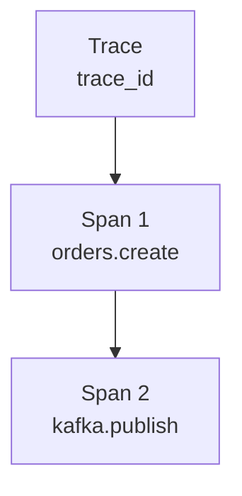
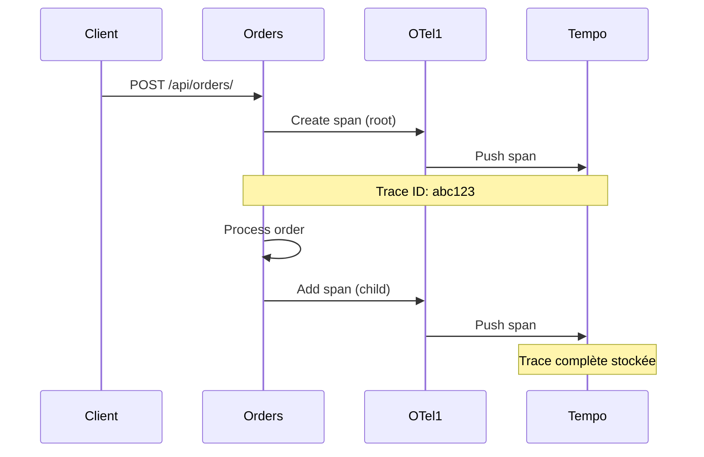

# Tempo - Traces Distribuées

## Vue d'ensemble

**Grafana Tempo** est un backend de traces distribuées conçu pour être simple, économique et compatible avec OpenTelemetry.

La configuration `infra/otel/tempo.yaml` décrit Docker Compose. Le chart Helm génère une configuration équivalente, expose Tempo en `ClusterIP` et conserve les blocs dans `/tmp/tempo/blocks` sans volume persistant dans l'environnement dev.

## Architecture

```mermaid
graph LR
    subgraph "Instrumentation"
        Orders[Orders Service]
        Inventory[Inventory Service]
        Payments[Payments Service]
    end
    
    subgraph "Collecte"
        OTel[OTel Collector]
    end
    
    subgraph "Stockage"
        Tempo[Tempo<br/>:3200]
        Storage[/tmp/tempo/blocks]
    end
    
    subgraph "Visualisation"
        Grafana[Grafana]
    end
    
    Orders -->|OTLP gRPC| OTel
    Inventory -->|OTLP gRPC| OTel
    Payments -->|OTLP gRPC| OTel
    
    OTel -->|OTLP gRPC| Tempo
    Tempo --> Storage
    
    Grafana -->|Query| Tempo
```

## Configuration

### Fichier de Configuration

```yaml
# infra/otel/tempo.yaml
server:
  http_listen_port: 3200

distributor:
  receivers:
    otlp:
      protocols:
        grpc:
          endpoint: 0.0.0.0:4317

storage:
  trace:
    backend: local
    local:
      path: /tmp/tempo/blocks
```

**Explications** :
- `http_listen_port` : Port HTTP pour l'API
- `distributor.receivers.otlp` : Réception via OTLP gRPC
- `storage.trace.backend` : Stockage local (fichiers)

### OTel Collector Exporter

```yaml
# infra/otel/otel-collector-config.yaml
exporters:
  otlp/tempo:
    endpoint: "tempo:4317"
    tls:
      insecure: true

service:
  pipelines:
    traces:
      receivers: [otlp]
      processors: [batch]
      exporters: [otlp/tempo]
```

## Structure d'une Trace

### Composants



### Exemple de Trace Complète

```json
{
  "traceId": "abc123def456...",
  "spans": [
    {
      "traceId": "abc123...",
      "spanId": "span1",
      "name": "POST /api/orders/",
      "kind": "SERVER",
      "startTimeUnixNano": 1721721600000000000,
      "endTimeUnixNano": 1721721600050000000,
      "attributes": {
        "http.method": "POST",
        "http.url": "/api/orders/",
        "http.status_code": 201,
        "service.name": "orders"
      },
      "status": {
        "code": "OK"
      }
    },
    {
      "traceId": "abc123...",
      "spanId": "span2",
      "parentSpanId": "span1",
      "name": "kafka publish",
      "kind": "PRODUCER",
      "startTimeUnixNano": 1721721600045000000,
      "endTimeUnixNano": 1721721600048000000,
      "attributes": {
        "messaging.system": "kafka",
        "messaging.destination": "orders.created",
        "service.name": "orders"
      }
    }
  ]
}
```

## Recherche de Traces

### Via Grafana

1. Aller dans **Explore**
2. Sélectionner la datasource **Tempo**
3. Rechercher par :
   - **Trace ID** : `abc123def456...`
   - **Service** : `orders`
   - **Span name** : `POST`
   - **Tags** : `http.status_code=500`

### Via l'API

```bash
# Rechercher par trace ID
curl http://localhost:3200/traces/abc123def456...

# Rechercher par service
curl 'http://localhost:3200/search?service=orders'

# Rechercher par tag
curl 'http://localhost:3200/search?tag=http.status_code:500'
```

## Visualisation dans Grafana

### Diagramme de Flux



### Exemple de Vue Grafana

```
Trace: abc123def456...
Duration: 52ms

┌─────────────────────────────────────────┐
│ POST /api/orders/                       │ 50ms
│ ┌─────────────────────────────────────┐ │
│ │ kafka publish                       │ │ 3ms
│ └─────────────────────────────────────┘ │
└─────────────────────────────────────────┘

Attributes:
  http.method: POST
  http.url: /api/orders/
  http.status_code: 201
  service.name: orders
```

## Intégration avec Grafana

### Data Source

```yaml
# infra/otel/datasources.yml
- name: Tempo
  type: tempo
  uid: tempo
  url: http://tempo:3200
  access: proxy
```

### Configuration dans Grafana

1. **Configuration** → **Data Sources**
2. **Tempo** (déjà configuré)
3. **Trace to metrics** : Lien vers Prometheus
4. **Trace to logs** : Lien vers Loki

### Trace to Metrics

Permet de naviguer d'une trace vers les metrics associées :

```
Trace span (duration: 50ms)
  ↓
Metrics pour ce service/endpoint
  ↓
Graphique de la latence
```

### Trace to Logs

Permet de naviguer d'une trace vers les logs associés :

```logql
{trace_id="abc123def456..."}
```

## Recherche Avancée

### Find Traces by Attribute

```bash
# Traces avec status code 500
curl 'http://localhost:3200/search?tag=http.status_code:500'

# Traces du service orders
curl 'http://localhost:3200/search?service=orders'

# Traces avec durée > 100ms
curl 'http://localhost:3200/search?minDuration=100ms'
```

### Spans par Service

```bash
# Lister les services
curl http://localhost:3200/api/services

# Lister les spans pour un service
curl http://localhost:3200/api/services/orders/spans
```

## Monitoring des Traces

### Métriques Tempo

```bash
# Via Prometheus
curl http://localhost:9090/api/v1/query?query=tempo_process_bytes_total
```

### Health Check

```bash
curl http://localhost:3200/ready
```

Réponse : `ready`

## Bonnes Pratiques

### Naming des Spans

```python
# Bon
span.name = "POST /api/orders/"
span.name = "kafka publish orders.created"

# Mauvais
span.name = "process"
span.name = "do_stuff"
```

### Attributes Importants

```python
# HTTP
http.method = "POST"
http.url = "/api/orders/"
http.status_code = 201

# Kafka
messaging.system = "kafka"
messaging.destination = "orders.created"
messaging.operation = "publish"

# Business (à ajouter)
order.id = "uuid-123"
customer.id = "user-456"
```

### Sampling

Pour la production, échantillonner les traces :

```python
from opentelemetry.sdk.trace.sampling import ParentBasedTraceIdRatio

sampler = ParentBasedTraceIdRatio(0.1)  # 10% des traces
```

## Limitations Connues

1. **Stockage local** : `/tmp/tempo/blocks` (non persistant)
2. **Pas de compression** : Consommation disque élevée
3. **Single node** : Pas de haute disponibilité
4. **Pas de retention** : Données perdues au redémarrage
5. **Recherche limitée** : Pas d'indexation avancée

## Pour la Production

```yaml
# Configuration production
storage:
  trace:
    backend: s3  # ou gcs, azure
    s3:
      bucket: "my-traces-bucket"
      endpoint: s3.amazonaws.com
      region: us-east-1
      accessKey: "${AWS_ACCESS_KEY}"
      secretKey: "${AWS_SECRET_KEY}"

ingestion:
  trace:
    max_bytes_per_trace: 1000000
    max_traces_per_second: 10000

compactor:
  compaction:
    block_retention: 24h  # Retention 24h
```

## Commandes Utiles

```bash
# Vérifier l'état
curl http://localhost:3200/ready

# Lister les traces récentes
curl http://localhost:3200/search

# Exporter une trace
curl http://localhost:3200/traces/abc123 > trace.json
```
