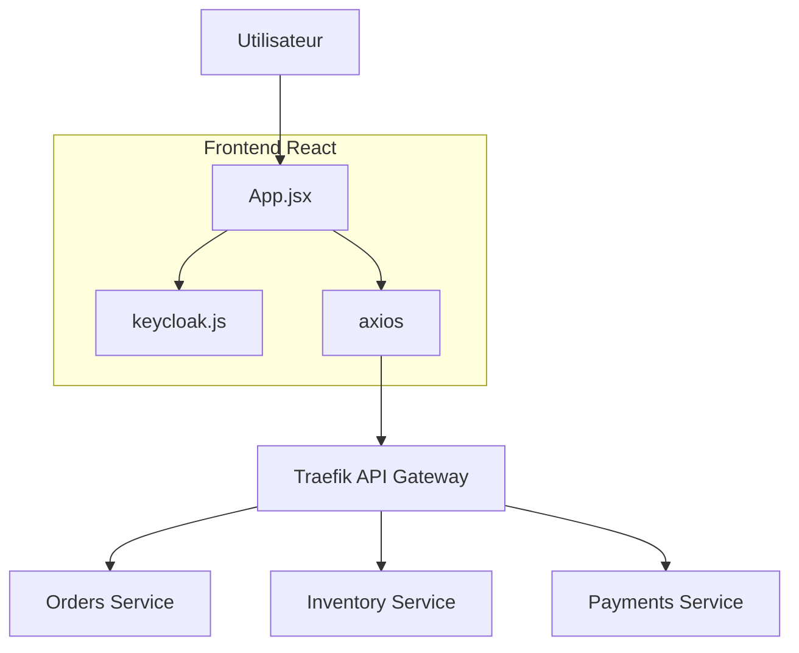
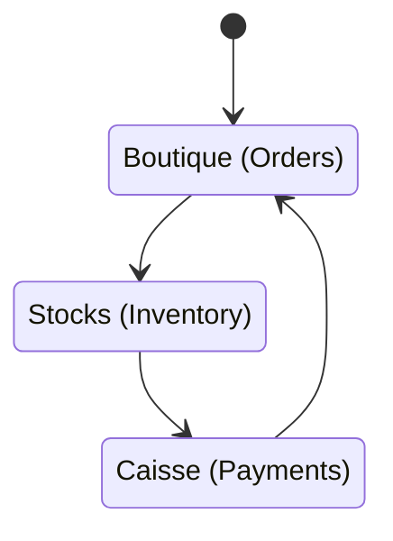

# Frontend React

## Vue d'ensemble

Le **Frontend** est une application React (SPA) qui sert d'interface utilisateur pour la plateforme e-commerce. Elle interagit avec les microservices via l'API Gateway Traefik et gère l'authentification Keycloak.

Le fonctionnement documenté est celui du code actuel : les URLs API et Keycloak sont écrites en `http://localhost`. Le chart Helm expose bien le frontend par Ingress, mais ne fournit pas de variables de remplacement pour ces URLs.

### Caractéristiques

- **Technologie** : React 19 + Vite
- **Port interne** : 5173
- **Route prefix** : `/` (root)
- **Build** : Vite
- **State Management** : React Hooks (useState, useEffect)

## Architecture



## Structure de l'Application

### Fichiers Principaux

| Fichier | Description |
|---------|-------------|
| `src/App.jsx` | Composant principal, gestion d'état, appels API |
| `src/keycloak.js` | Configuration Keycloak |
| `src/main.jsx` | Point d'entrée React |
| `src/App.css` | Styles de l'application |
| `index.html` | Template HTML |

### Catalogue de Produits

```javascript
const CATALOGUE = [
  { id: 'LAPTOP-001', name: 'Ordinateur Portable Pro', icon: '💻', price: 1299 },
  { id: 'PHONE-002', name: 'Smartphone Z-Fold', icon: '📱', price: 899 },
  { id: 'MUG-003', name: 'Mug Développeur', icon: '☕', price: 15 }
];
```

## Navigation par Onglets

L'application utilise une navigation par onglets pour séparer les fonctionnalités :



### Onglet 1 : Boutique (Orders Service)

**Fonctionnalité** : Passer des commandes

**Flux** :
1. Affiche le catalogue de produits
2. Utilisateur clique sur "Commander"
3. Appel API `POST /api/orders/`
4. Réception de l'order_id
5. Affichage d'une notification de succès
6. Redirection automatique vers l'onglet Stocks

**Code** :
```javascript
const commanderProduit = async (productId, price) => {
  const orderPayload = {
    product_id: productId,
    customer_id: keycloak.tokenParsed?.preferred_username,
    quantity: 1
  };
  
  await axios.post('http://localhost/api/orders/', orderPayload, {
    headers: { Authorization: `Bearer ${keycloak.token}` }
  });
};
```

### Onglet 2 : Stocks (Inventory Service)

**Fonctionnalité** : Visualiser les niveaux de stock

**Fonctionnalités** :
- Affiche le stock disponible pour chaque produit
- Calcule : `disponible = total - reserved`
- Bouton d'actualisation manuelle
- Indicateur visuel (vert/rouge) pour le statut

**Code** :
```javascript
const fetchStocks = async () => {
  for (const produit of CATALOGUE) {
    const response = await axios.get(
      `http://localhost/api/inventory/stock/${produit.id}`,
      { headers: { Authorization: `Bearer ${keycloak.token}` } }
    );
    updatedStocks[produit.id] = response.data;
  }
};
```

### Onglet 3 : Caisse (Payments Service)

**Fonctionnalité** : Payer les commandes en attente

**Fonctionnalités** :
- Liste des commandes créées (stockées localement)
- Bouton "Payer" pour chaque commande
- Mise à jour du statut après paiement
- Actualisation des stocks après paiement

**Code** :
```javascript
const payerCommande = async (order) => {
  const paymentPayload = {
    order_id: order.order_id,
    product_id: order.product_id,
    quantity: order.quantity,
    amount: order.price
  };
  
  await axios.post('http://localhost/api/payments/pay', paymentPayload, {
    headers: { Authorization: `Bearer ${keycloak.token}` }
  });
};
```

## Authentification Keycloak

### Configuration

```javascript
// src/keycloak.js
import Keycloak from 'keycloak-js';

const keycloakConfig = {
  url: 'http://localhost/auth',
  realm: 'ecommerce',
  clientId: 'ecomm-front'
};

const keycloak = new Keycloak(keycloakConfig);
```

### Initialisation

```javascript
// Dans App.jsx
await keycloak.init({ onLoad: 'check-sso' });

// Vérification du token
if (!keycloak.authenticated) {
  keycloak.login();
}
```

### Refresh du Token

```javascript
useEffect(() => {
  const interval = setInterval(() => {
    keycloak.updateToken(60).catch(() => keycloak.logout());
  }, 4 * 60 * 1000); // Toutes les 4 minutes
  return () => clearInterval(interval);
}, []);
```

### Déconnexion

```javascript
<button onClick={() => keycloak.logout()}>
  Déconnexion
</button>
```

## Appels API

### Configuration Axios

Tous les appels incluent le token JWT :

```javascript
axios.get('http://localhost/api/inventory/stock/LAPTOP-001', {
  headers: { Authorization: `Bearer ${keycloak.token}` }
});
```

### Base URL

Les APIs sont accessibles via `http://localhost` dans le parcours prévu par le code actuel (Traefik route vers les services). Un hostname Ingress personnalisé nécessite aussi d'aligner la configuration Keycloak et les URLs utilisées par le frontend ; le DNS seul ne suffit pas.

## Déploiement Kubernetes

Le chart `infra/helm/charts/frontend` :

- déploie une replica avec l'image `frontend:latest` en dev ;
- expose un service `ClusterIP` sur le port `5173` ;
- crée un Ingress `/` avec `IngressClass` `traefik` ;
- utilise une probe HTTP sur `/` ;
- ne configure pas d'`env` pour remplacer les URLs `localhost`.

Dans Docker Compose, le répertoire `frontend/` est monté en volume pour le HMR. Le parcours Helm utilise une image construite par `deploy-images.sh` et ne reproduit pas ce montage de code source.

## Gestion d'État

### États Principaux

```javascript
const [activeTab, setActiveTab] = useState('boutique');
const [notification, setNotification] = useState(null);
const [recentOrders, setRecentOrders] = useState([]);
const [stocks, setStocks] = useState({});

const [loadingOrder, setLoadingOrder] = useState(null);
const [loadingStocks, setLoadingStocks] = useState(false);
const [loadingPayment, setLoadingPayment] = useState(null);
```

### Stockage Local des Commandes

Les commandes créées sont stockées localement dans l'état `recentOrders` pour pouvoir être payées :

```javascript
const newOrder = {
  order_id: response.data.order_id,
  product_id: productId,
  customer_id: customerId,
  quantity: 1,
  price: price,
  status: 'pending'
};
setRecentOrders(prev => [newOrder, ...prev]);
```

## UX/UI

### Notifications

Notifications de succès/erreur après chaque action :

```javascript
setNotification({
  type: 'success',  // ou 'error'
  message: 'Commande créée ! ID: xxx...'
});
```

### Indicateurs de Chargement

Boutons désactivés pendant les opérations asynchrones :

```javascript
<button 
  disabled={loadingOrder === productId}
  style={{ backgroundColor: loadingOrder === productId ? '#9ca3af' : '#3b82f6' }}
>
  {loadingOrder === productId ? 'Publication...' : 'Commander'}
</button>
```

### Couleurs d'État

| État | Couleur | Usage |
|------|---------|-------|
| En stock | Vert (#10b981) | Stock disponible |
| Rupture | Rouge (#ef4444) | Stock épuisé |
| Pending | Jaune (#f59e0b) | Commande en attente |
| Paid | Vert (#10b981) | Paiement validé |

## Dépendances

```json
{
  "dependencies": {
    "axios": "^1.18.1",
    "keycloak-js": "^26.2.4",
    "react": "^19.2.7",
    "react-dom": "^19.2.7"
  },
  "devDependencies": {
    "@vitejs/plugin-react": "^6.0.3",
    "vite": "^8.1.1",
    "eslint": "^10.6.0"
  }
}
```

## Scripts

```json
{
  "scripts": {
    "dev": "vite",
    "build": "vite build",
    "lint": "eslint .",
    "preview": "vite preview"
  }
}
```

## Limitations Connues

1. **Stockage local** : Les commandes ne persistent pas après refresh
2. **Pas de routing** : Navigation par onglets, pas de routes URL
3. **Pas de gestion d'erreur globale** : Chaque appel gère ses erreurs
4. **URLs en dur** : `http://localhost` est codé dans le frontend, sans configuration par environnement
5. **Pas de loading skeleton** : Pas d'indicateur pendant le chargement initial

## Pour aller plus loin

- Implémenter React Router pour le routing URL
- Ajouter un state management global (Redux, Zustand)
- Créer des composants réutilisables
- Implémenter les skeletons de chargement
- Ajouter le support du offline mode
- Mettre en place un système de notifications toast
- Ajouter les tests unitaires (Vitest, React Testing Library)
