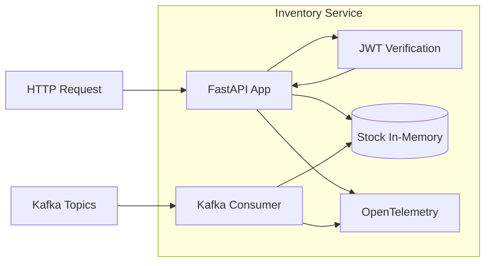
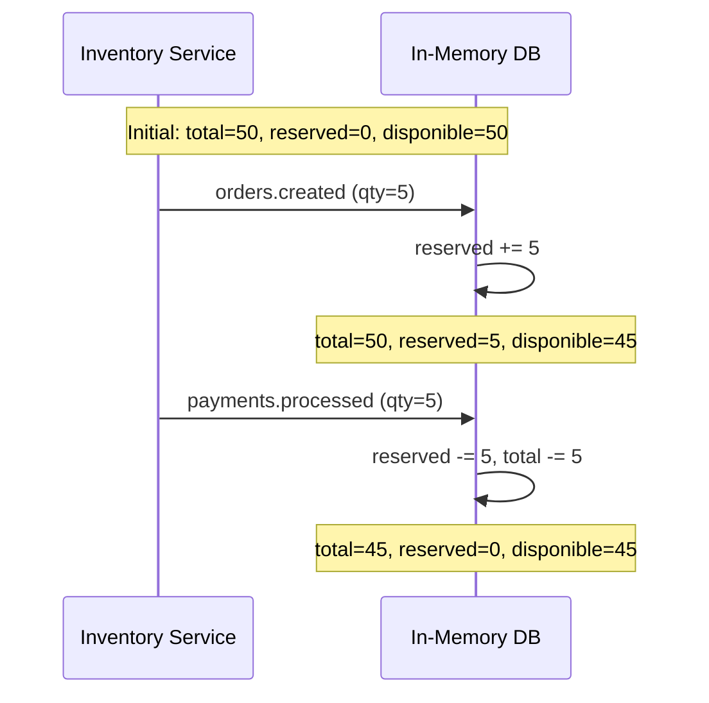

# Inventory Service

## Vue d'ensemble

Le **Inventory Service** gère le stock des produits et les réservations. Il écoute les événements Kafka pour mettre à jour les niveaux de stock de manière asynchrone.

### Caractéristiques

- **Technologie** : Python 3.11 + FastAPI
- **Port interne** : 8000
- **Route prefix** : `/api/inventory`
- **State** : In-memory (démonstration)
- **Kafka** : Consommateur uniquement

## Architecture du Service



## Base de Données In-Memory

```python
inventory_db = {
    "LAPTOP-001": {"total": 50, "reserved": 0},
    "PHONE-002": {"total": 2, "reserved": 0},
    "MUG-003": {"total": 100, "reserved": 0}
}
```

**Note** : En production, utiliser une base de données persistante (PostgreSQL, MongoDB).

## Endpoints API

### GET `/stock/{product_id}`

Récupère le stock disponible pour un produit.

**Path Parameter** :
- `product_id` : Identifiant du produit (ex: `LAPTOP-001`)

**Response** (200 OK) - Produit trouvé :
```json
{
  "product_id": "LAPTOP-001",
  "quantity": 45,
  "in_stock": true
}
```

**Response** (200 OK) - Produit introuvable :
```json
{
  "product_id": "UNKNOWN-001",
  "error": "Produit introuvable",
  "in_stock": false
}
```

**Authentification** : Requise (JWT token)

### GET `/health`

Health check du service.

**Response** (200 OK) :
```json
{
  "status": "OK",
  "service": "inventory"
}
```

**Authentification** : Non requise

## Configuration Kafka

Le service consomme deux topics :

```python
consumer = AIOKafkaConsumer(
    'orders.created', 
    'payments.processed',
    bootstrap_servers='kafka:9092',
    group_id='inventory-group',
    auto_offset_reset="earliest",
)
```

### Événements Consommés

#### 1. `orders.created` - Réservation de stock

**Action** : Réserve le stock temporairement

```python
if topic == 'orders.created':
    product_id = data.get("product_id")
    qty = data.get("quantity", 0)
    
    # Vérification du produit
    if product_id not in inventory_db:
        logger.error(f"ALERTE : Produit inconnu ({product_id})")
        continue
    
    # Vérification du stock disponible
    stock_dispo = inventory_db[product_id]["total"] - inventory_db[product_id]["reserved"]
    if qty > stock_dispo:
        logger.error(f"RUPTURE : Pas assez de stock pour {product_id}")
        continue
    
    # Réservation
    inventory_db[product_id]["reserved"] += qty
```

**Logique** :
1. Vérifie que le produit existe
2. Vérifie qu'il y a assez de stock disponible
3. Incrémente le compteur `reserved`
4. Le stock disponible = `total - reserved`

#### 2. `payments.processed` - Confirmation de commande

**Action** : Déduit définitivement le stock

```python
elif topic == 'payments.processed':
    product_id = data.get("product_id")
    qty = data.get("quantity", 0)
    
    if product_id and product_id in inventory_db:
        inventory_db[product_id]["reserved"] -= qty
        inventory_db[product_id]["total"] -= qty
```

**Logique** :
1. Décrémente `reserved` (fin de la réservation)
2. Décrémente `total` (vente confirmée)

## Flux de Gestion de Stock



## Configuration OpenTelemetry

Identique aux autres services :

```python
resource = Resource(attributes={"service.name": "inventory"})
# Traces, Metrics, Logs configurés de la même manière
```

## Dépendances

Mêmes dépendances que Orders Service + aiokafka pour la consommation.

## Logs Importants

| Message | Niveau | Signification |
|---------|--------|---------------|
| `Connecté au broker Kafka, en écoute...` | INFO | Consumer démarré |
| `Réservation de {qty} unité(s) de {product_id}` | INFO | Stock réservé |
| `Nouveau stock dispo pour {product_id} : {qty}` | INFO | Stock mis à jour |
| `Paiement confirmé : {qty} unité(s) déduite(s)` | INFO | Vente confirmée |
| `RUPTURE : Pas assez de stock` | ERROR | Échec réservation |
| `ALERTE : Produit inconnu` | ERROR | Produit non répertorié |

## Alerte de Rupture dans Grafana

Le dashboard Grafana inclut une alerte visuelle pour les ruptures :

```logql
count_over_time({service_name="inventory"} |= "RUPTURE" [1m])
```

Cette requête compte les événements "RUPTURE" dans la dernière minute.

## Limitations Connues

1. **Stock in-memory** : Perte des données au redémarrage
2. **Pas de concurrence** : Pas de locking pour les mises à jour
3. **Pas de validation** : Ne vérifie pas la validité des données Kafka
4. **Quantité fixe** : Ne gère pas les retours produits
5. **Catalogue statique** : Produits pré-définis, pas d'API CRUD

## Pour aller plus loin

- Implémenter une base de données persistante
- Ajouter des verrous optimistes/pessimistes pour la concurrence
- Créer un endpoint pour ajouter/modifier des produits
- Implémenter un système de réapprovisionnement automatique
- Ajouter l'historique des mouvements de stock
