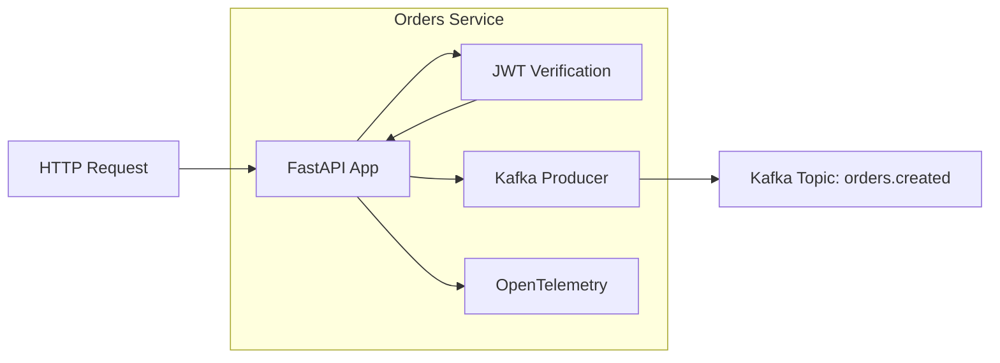
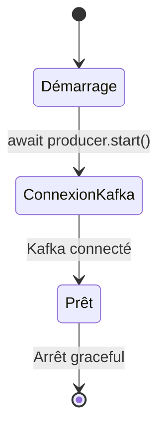

# Orders Service

## Vue d'ensemble

Le **Orders Service** est responsable de la création et de la gestion des commandes. C'est le point d'entrée du flux de commande dans l'architecture.

### Caractéristiques

- **Technologie** : Python 3.11 + FastAPI
- **Port interne** : 8000
- **Route prefix** : `/api/orders`
- **State** : Stateless (pas de base de données)
- **Kafka** : Producteur uniquement

## Architecture du Service



## Fichiers Source

| Fichier | Description |
|---------|-------------|
| `main.py` | Application FastAPI, routes, configuration OTel |
| `security.py` | Validation JWT avec Keycloak |
| `requirements.txt` | Dépendances Python |
| `Dockerfile` | Configuration conteneur |

## Endpoints API

### POST `/`

Crée une nouvelle commande et publie un événement Kafka.

**Request Body** :
```json
{
  "product_id": "LAPTOP-001",
  "customer_id": "user123",
  "quantity": 1
}
```

**Response** (201 Created) :
```json
{
  "order_id": "550e8400-e29b-41d4-a716-446655440000",
  "status": "pending",
  "message": "Order created successfully",
  "data": {
    "product_id": "LAPTOP-001",
    "customer_id": "user123",
    "quantity": 1
  }
}
```

**Authentification** : Requise (JWT token)

### GET `/health`

Health check du service.

**Response** (200 OK) :
```json
{
  "status": "OK",
  "service": "orders"
}
```

**Authentification** : Non requise

## Configuration Kafka

Le service utilise `aiokafka` pour produire des événements :

```python
producer = AIOKafkaProducer(
    bootstrap_servers='kafka:9092',
    value_serializer=lambda v: json.dumps(v).encode('utf-8')
)
```

### Événement Produit

**Topic** : `orders.created`

**Schema** :
```json
{
  "order_id": "uuid",
  "product_id": "string",
  "quantity": "integer",
  "customer_id": "string",
  "status": "pending"
}
```

## Configuration OpenTelemetry

### Traces

```python
tracer_provider = TracerProvider(resource=Resource(attributes={"service.name": "orders"}))
tracer_exporter = OTLPSpanExporter(endpoint="http://otel-collector:4317", insecure=True)
tracer_provider.add_span_processor(BatchSpanProcessor(tracer_exporter))
trace.set_tracer_provider(tracer_provider)
```

### Metrics

```python
metric_exporter = OTLPMetricExporter(endpoint="http://otel-collector:4317", insecure=True)
metric_reader = PeriodicExportingMetricReader(metric_exporter)
meter_provider = MeterProvider(resource=resource, metric_readers=[metric_reader])
metrics.set_meter_provider(meter_provider)
```

### Logs

```python
log_provider = LoggerProvider(resource=resource)
log_exporter = OTLPLogExporter(endpoint="http://otel-collector:4317", insecure=True)
log_provider.add_log_record_processor(BatchLogRecordProcessor(log_exporter))
handler = LoggingHandler(logger_provider=log_provider)
logging.getLogger("orders").addHandler(handler)
```

## Dépendances

```txt
fastapi
uvicorn
python-dotenv
aiokafka
opentelemetry-api
opentelemetry-sdk
opentelemetry-exporter-otlp
opentelemetry-instrumentation-fastapi
opentelemetry-instrumentation-logging
python-jose[cryptography]
requests
```

## Cycle de Vie du Service



### Logs de Démarrage

```
2024-07-23 10:00:00 - INFO - Demarrage du service Orders...
2024-07-23 10:00:01 - INFO - Tentative de connexion au broker Kafka (Producer)...
2024-07-23 10:00:02 - INFO - Producer Kafka connecte avec succes au cluster.
```

## Logs Importants

| Message | Niveau | Signification |
|---------|--------|---------------|
| `Demarrage du service Orders...` | INFO | Service en démarrage |
| `Producer Kafka connecte...` | INFO | Connexion Kafka établie |
| `Requete de creation de commande recue` | INFO | Nouvelle commande reçue |
| `Evenement publie sur le topic 'orders.created'` | INFO | Événement envoyé à Kafka |
| `Producer deconnecte proprement.` | INFO | Arrêt graceful |

## Limitations Connues

1. **Pas de persistance** : Les commandes ne sont pas stockées, seulement les événements
2. **Pas de validation produit** : Ne vérifie pas si le produit existe
3. **Pas de gestion d'erreur Kafka** : Si Kafka est indisponible, la requête échoue
4. **Customer ID générique** : Utilise le username Keycloak sans validation

## Pour aller plus loin

- Implémenter une base de données pour persister les commandes
- Ajouter une file d'attente morte (DLQ) pour les événements échoués
- Implémenter des retries avec backoff exponentiel
- Ajouter la validation du produit avant création de commande
