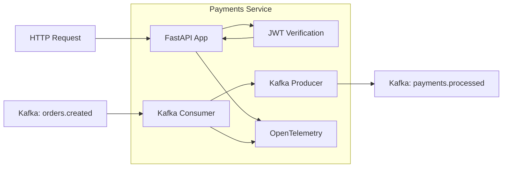
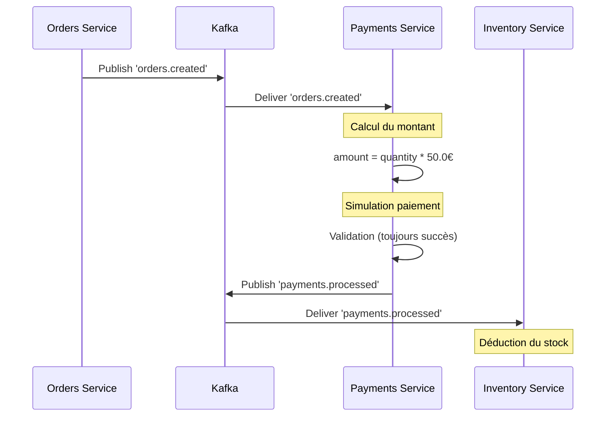

# Payments Service

## Vue d'ensemble

Le **Payments Service** gère le traitement des paiements. Il écoute les événements de commande, simule le traitement du paiement, et publie les résultats.

### Caractéristiques

- **Technologie** : Python 3.11 + FastAPI
- **Port interne** : 8000
- **Route prefix** : `/api/payments`
- **State** : Stateless (simulation)
- **Kafka** : Consommateur ET Producteur

## Architecture du Service



## Flux de Paiement



## Endpoints API

### POST `/pay`

Déclenche un paiement (endpoint API pour le frontend).

**Request Body** :
```json
{
  "order_id": "550e8400-e29b-41d4-a716-446655440000",
  "amount": 50.0
}
```

**Response** (201 Created) :
```json
{
  "transaction_id": "770f9511-f39c-4e2d-b816-223344550000",
  "order_id": "550e8400-e29b-41d4-a716-446655440000",
  "status": "success",
  "message": "Payment processed successfully"
}
```

**Authentification** : Requise (JWT token)

**Note** : Cet endpoint retourne un succès immédiat. Le traitement asynchrone via Kafka est indépendant.

### GET `/health`

Health check du service.

**Response** (200 OK) :
```json
{
  "status": "OK",
  "service": "payments"
}
```

**Authentification** : Non requise

## Configuration Kafka

### Consumer

```python
consumer = AIOKafkaConsumer(
    'orders.created',
    bootstrap_servers='kafka:9092',
    group_id='payment-group',
    auto_offset_reset="earliest",
)
```

### Producer

```python
producer = AIOKafkaProducer(
    bootstrap_servers="kafka:9092",
    value_serializer=lambda v: json.dumps(v).encode("utf-8"),
)
```

## Logique de Traitement

### 1. Réception de l'événement

```python
async for msg in consumer:
    commande = json.loads(msg.value.decode('utf-8'))
```

### 2. Calcul du montant

```python
# Simulation: 50€ par unité
montant = commande['quantity'] * 50.0
```

**Note** : Le prix est fixe à 50€. En production, récupérer le prix du produit.

### 3. Simulation du paiement

```python
logger.info(f"Paiement simulé de {montant}€ validé.")
```

**Note** : Toujours succès. En production, intégrer un gateway de paiement (Stripe, PayPal).

### 4. Publication du résultat

```python
event = {
    "order_id": commande["order_id"],
    "customer_id": commande["customer_id"],
    "product_id": commande["product_id"],
    "quantity": commande["quantity"],
    "amount": montant,
    "status": "success",
}
await producer.send_and_wait("payments.processed", event)
```

## Événement Produit

**Topic** : `payments.processed`

**Schema** :
```json
{
  "order_id": "uuid",
  "customer_id": "string",
  "product_id": "string",
  "quantity": "integer",
  "amount": "float",
  "status": "success"
}
```

## Configuration OpenTelemetry

Configuration identique aux autres services avec le nom de service `payments` :

```python
resource = Resource(attributes={"service.name": "payments"})
```

## Dépendances

```txt
fastapi
uvicorn
python-dotenv
aiokafka
opentelemetry-api
opentelemetry-sdk
opentelemetry-exporter-otlp
opentelemetry-instrumentation-fastapi
opentelemetry-instrumentation-logging
python-jose[cryptography]
requests
```

## Cycle de Vie

```python
@asynccontextmanager
async def lifespan(app: FastAPI):
    global producer
    logger.info("Démarrage du service Payments...")
    
    # Démarrage du producer
    producer = AIOKafkaProducer(...)
    await producer.start()
    logger.info("Producer Kafka connecté !")
    
    # Démarrage du consumer (tâche asynchrone)
    task = asyncio.create_task(listen_kafka())
    
    yield  # Service en cours
    
    # Arrêt
    task.cancel()
    await producer.stop()
```

## Logs Importants

| Message | Niveau | Signification |
|---------|--------|---------------|
| `Démarrage du service Payments...` | INFO | Service en démarrage |
| `Producer Kafka connecté !` | INFO | Producer prêt |
| `Connecté au broker Kafka (Consumer)` | INFO | Consumer prêt |
| `Commande interceptée : {order_id}` | INFO | Événement reçu |
| `Paiement simulé de {montant}€ validé` | INFO | Paiement traité |
| `Événement de paiement publié...` | INFO | Événement envoyé |
| `Erreur lors de la connexion au broker Kafka` | ERROR | Retry consumer |

## Limitations Connues

1. **Paiement simulé** : Toujours succès, pas de vérification réelle
2. **Prix fixe** : 50€ par unité, indépendant du produit
3. **Pas de transaction** : L'endpoint API et l'événement Kafka sont découplés
4. **Pas d'historique** : Pas de stockage des transactions
5. **Pas de gestion d'erreur** : Pas de retry ou DLQ

## Pour aller plus loin

- Intégrer un vrai gateway de paiement (Stripe, PayPal)
- Récupérer le prix réel du produit depuis Inventory
- Implémenter les échecs de paiement et retries
- Stocker l'historique des transactions
- Ajouter la gestion des remboursements
- Implémenter la conformité PCI-DSS
- Ajouter la validation 3D Secure
